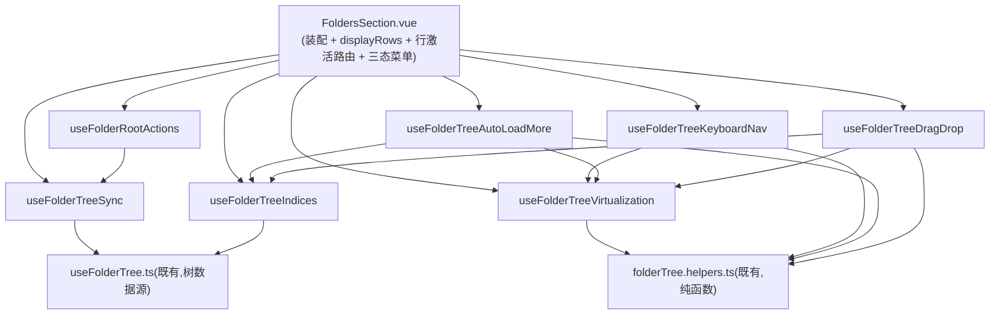

# 拆分方案:FoldersSection.vue

## 0. 结论摘要
`FoldersSection.vue` 是侧栏「文件夹」区块的单体组件:虚拟化文件树渲染 + 键盘导航(WAI-ARIA tree) +
拖拽移动/复制(目录与文件两路)+ 分页自动加载 + 树的加载/刷新生命周期 + 根目录管理(新增/迁移/新建
子文件夹)全部塞在一个 `<script setup>` 里。纯逻辑(路径身份判定、拍平、窗口计算、粘性头链、键盘决策)
已经在此前 T1 系列里下沉到同目录 `folderTree.helpers.ts`(420 行,已有 `folderTree.helpers.spec.ts`
单测覆盖),但**有状态的编排代码**(ref/watch/生命周期/DOM 交互)仍全部留在组件本体,这是本文件真正
的体量来源。

建议按「关注点」拆成 **7 个 composable + 2 个下沉到既有 helpers 的纯函数**,组件本体只保留:store/
composable 装配、`displayRows`、场景菜单(三态显示)UI 状态、行激活的路由决策(`onNodeClick` /
`onFileClick` / `navigateToFolder` / `showAll`)。template 与 style 不建议拆(见 §2.5 的理由),只有
script 部分被拆分。

---

## 1. 现状结构图

### 1.1 script setup 逻辑域(按文件内出现顺序)

| # | 逻辑域 | 职责 | 约行数 | 符号锚点 |
|---|--------|------|--------|----------|
| 1 | 装配层 | imports、defineProps、6 个 store、`useFolderTree`/`useConfirm`/router/i18n 初始化 | ~80 | `defineProps<{ order`、`const folderTree = useFolderTree(` |
| 2 | 行拍平 | dirs/files 交错拍平为显示行(委托 `flattenFolderRows`) | ~12 | `const displayRows = computed(` |
| 3 | 树虚拟化核心 | ROW_H/TREE_INDENT/BUFFER 常量、`treeRef`/`scrollAreaEl`、窗口计算 `updateWindow`/`scheduleUpdate`、行高实测、粘性区块标题堆叠插位(`stackTopPx`/`stackBottomPx`,依赖 `useSidebarSections`)、`initScroll`/mount-unmount 绑定 | ~145 | `const ROW_H = 28`、`function updateWindow`、`function initScroll`、首个 `onBeforeUnmount` |
| 4 | 滚动到节点 | 结构轴(`nodeKey`)滚动定位,供粘性头点击/树同步使用 | ~20 | `async function scrollTreeToNodeKey` |
| 5 | 键盘导航 | `activeIndex`/`activeDescId`/`rowDomId`、`setActiveIndex`/`scrollRowIntoView`、`onTreeFocus`/`onTreeKeydown`(委托纯函数 `treeKeyTarget`) | ~75 | `const activeIndex = ref(-1)`、`function onTreeKeydown` |
| 6 | 文件图标/tooltip | `fileIcon`、`fileTitle`(近纯函数,仅需 `t` 与 `isMobilePlatform`) | ~30 | `function fileIcon`、`function fileTitle` |
| 7 | 文件行激活 | 单击选中/打开路由(`openMediaRoute`)、双击预览或 reveal(`REVEAL_TREE_ENTRY` IPC) | ~60 | `function onFileClick`、`function onFileDblClick` |
| 8 | 树↔画廊 目录同步 | `treeSyncTargetId` 计算、latest-wins 队列 `createFolderTreeSyncQueue`、`requestTreeSync` | ~20 | `const treeSyncTargetId = computed(`、`function requestTreeSync` |
| 9 | 树加载/重载生命周期 | `scan.visibleScanRoots` watch(唯一加载入口)、`pendingSelectRootId`、`reloadTreePreserveExpansion`、`folder-stats-changed`/`request-add-folder` 窗口事件 | ~85 | `watch(\n  () => scan.visibleScanRoots,`、`async function reloadTreePreserveExpansion`、`function onFolderStatsChanged` |
| 10 | 节点点击/导航 | `onNodeClick`(模式 A 滚动锚点 / 模式 B 可寻址路由)、`navigateToFolder`、`showAll` | ~45 | `function onNodeClick`、`function navigateToFolder`、`function showAll` |
| 11 | 显示范围三态菜单 | `SCOPE_OPTIONS`、`scopeMenuOpen`/`scopeAnchor`、`toggleScopeMenu`/`chooseScope` | ~30 | `const SCOPE_OPTIONS`、`function chooseScope` |
| 12 | 显示模式切换 + 刷新 | `watch(ui.treeDisplayMode)` 整树重载、`refreshTree`(失效缓存+重载) | ~30 | `watch(\n  () => ui.treeDisplayMode,`、`async function refreshTree` |
| 13 | 展开/折叠全部 | `anyExpanded`、`toggleExpandAll` | ~6 | `const anyExpanded`、`async function toggleExpandAll` |
| 14 | 「加载更多」自动接力分页 | `loadingMoreDirKey`/`autoLoadBlocked`、`loadMore`/`onLoadMore`、静止门 `maybeAutoLoadMore`/`scheduleSettleRetry`、滚动补偿 | ~75 | `const loadingMoreDirKey = ref`、`function maybeAutoLoadMore` |
| 15 | 拖拽索引 + 目录落点判定 | `nodesById`/`nodesByKey`(双身份索引)、`isDescendant`/`canDropOnId`、`recomputeDrop` | ~65 | `const nodesById = computed(`、`function canDropOnId` |
| 16 | 拖拽边缘自动滚动 | `EDGE_ZONE`/`EDGE_MAX_SPEED`、`autoScrollStep`/`updateAutoScroll`/`stopAutoScroll` | ~50 | `function autoScrollStep`、`function stopAutoScroll` |
| 17 | 目录拖拽手势 + 落地 | `onTreePointerDown`(阈值/ghost/suppressClick)、`performTreeDrop`(history.move/copy) | ~70 | `function onTreePointerDown`、`async function performTreeDrop` |
| 18 | 文件拖拽手势 + 落地 | `recomputeFileDrop`、`onFilePointerDown`、`performFileDrop`(history.moveMedia/copyMedia) | ~95 | `function recomputeFileDrop`、`async function performFileDrop` |
| 19 | 右键菜单 + 对话框状态 | `contextMenu`/`createDialog`/`filePreview`、`onNodeContextMenu` | ~35 | `const contextMenu = ref(`、`function onNodeContextMenu` |
| 20 | 重链接扫描根 | `RelinkResult`、`relinkRoot`(选路径→二次确认→IPC→按 code 分流→兜底重扫) | ~80 | `interface RelinkResult`、`async function relinkRoot` |
| 21 | 新建文件夹 | `createNewGlobalFolder`、`onFolderCreated` | ~10 | `function createNewGlobalFolder`、`function onFolderCreated` |
| 22 | 导入扫描根 | `OverlapInfo`/`FolderOverlapResult`、`addRoot`(重叠检测→添加→自动扫描→自动选中) | ~55 | `interface OverlapInfo`、`async function addRoot` |

### 1.2 template(约 291 行)

| 区块 | 职责 | 约行数 | 锚点 |
|------|------|--------|------|
| 头部操作插槽 | 全部/显示范围菜单钮/展开折叠全部/新建空白文件夹/添加文件夹 5 个控件 | ~38 | `<template #actions>` |
| 空态 | 无可见根时的占位文案 | ~6 | `class="empty"` |
| 虚拟化树容器 + 粘性头链 | `role="tree"` 容器、aria-activedescendant、粘性目录头覆盖层(T1-b) | ~35 | `class="tree"`、`class="tree-sticky"` |
| 树行(dir/file/more) | 三种行的按钮渲染,承载全部 class 绑定(active/drag-over/kb-active/is-hidden 等)与事件 | ~110 | `class="tree-layer"`、`row.kind === 'dir'` |
| 显示范围三态菜单 | `UiPopover` + `menuitemradio` 单选集 + 刷新 | ~30 | `<UiPopover v-model:open="scopeMenuOpen"` |
| 右键菜单 / 预览 / 新建对话框 | `ContextMenu`、`FilePreviewDialog`、Teleport 到 body 的 `FolderCreateDialog` | ~25 | `<ContextMenu`、`<FilePreviewDialog` |
| 拖拽浮动预览 | `pointer-events:none` 的 ghost 标签 | ~12 | `class="drag-ghost"` |

### 1.3 style scoped(约 340 行)

| 区块 | 锚点 |
|------|------|
| 头部操作窄侧栏适配 + show-all 胶囊 | `.folders-action`、`.show-all-btn` |
| 三态菜单视觉 | `.scope-menu`、`.scope-item` |
| 空态 | `.empty` |
| 树容器/虚拟化层/粘性头/目录行 | `.tree`、`.tree-layer`、`.tree-sticky`、`.tree-item` |
| 文件叶子行 | `.file-item` |
| 「加载更多」行 | `.more-item` |
| 行内构件(箭头/图标/标签/计数) | `.tree-arrow`、`.tree-chevron`、`.tree-count` |
| 拖拽浮动预览视觉 | `.drag-ghost` |

Style 内部耦合度低、按 class 前缀天然分区,不是体量主因(340 行本身不算超长),故不建议拆分——见 §2.5。

---

## 2. 拆分方案

### 2.1 新增 composable 清单(均放 `src/composables/`,与既有 `useFolderTree.ts` 同级)

| 文件 | 职责 | 迁移符号(来自现状表 §1.1) | 对外接口(输入 → 输出) |
|------|------|---------------------------|------------------------|
| `useFolderTreeIndices.ts` | 目录节点的双身份索引(D-013:实体轴 id / 结构轴 nodeKey)+ 祖先判定 | 域 15 的 `nodesById`/`nodesByKey`/`isDescendant`(`canDropOnId` 留在拖拽 composable,见下) | 入:`nodes: ComputedRef<DirNode[]>`。出:`{ nodesById, nodesByKey, isDescendant }` |
| `useFolderTreeVirtualization.ts` | 行窗口化、行高实测、粘性区块堆叠插位、粘性目录头链、结构轴滚动定位;是体量最大也是其余多数 composable 的基础设施 | 域 3、域 4 全部 | 入:`displayRows: ComputedRef<TreeRow[]>`, `sectionId: 'folders'`(或直接注入 `useSidebarSections()`)。出:`{ treeRef, spacerHeight, offsetY, visibleRows, startIndex, firstVisibleIndex, stickyRows, rowH, stackTopPx, stackBottomPx, treeOffsetTop, scrollAreaEl(shallowRef,供其余 composable 读/写 scrollTop), scheduleUpdate, updateWindow, scrollTreeToNodeKey, getLastScrollTs() }` |
| `useFolderTreeKeyboardNav.ts` | WAI-ARIA tree 键盘决策的副作用层(域 5) | `activeIndex`/`activeDescId`/`rowDomId`/`setActiveIndex`/`scrollRowIntoView`/`onTreeFocus`/`onTreeKeydown` | 入:`displayRows`, virtualization 的 `{ treeOffsetTop, scrollAreaEl, rowH, stackTopPx, stackBottomPx }`,行激活回调 `{ onNodeClick, onFileClick, onFileDblClick, onLoadMore, toggleNode: folderTree.toggleNode }`。出:`{ activeIndex, activeDescId, setActiveIndex, onTreeFocus, onTreeKeydown }` |
| `useFolderTreeAutoLoadMore.ts` | 「加载更多」自动接力 + 快滚静止门 + 滚动补偿(域 14) | `loadingMoreDirKey`/`autoLoadBlocked`/`loadMore`/`onLoadMore`/`maybeAutoLoadMore`/`scheduleSettleRetry` | 入:`displayRows`, `visibleRows`, `nodesByKey`, virtualization 的 `{ scrollAreaEl, rowH, firstVisibleIndex, updateWindow, getLastScrollTs }`, `folderTree.loadMoreFiles`。出:`{ loadingMoreDirKey, onLoadMore }` + 内部 `watch(visibleRows, maybeAutoLoadMore)` |
| `useFolderTreeDragDrop.ts` | 目录 + 文件两路指针拖拽、共用的 ghost/边缘自动滚动/落点高亮(域 16、17、18,以及域 15 的 `canDropOnId`/`recomputeDrop`) | `dragId`/`dropId`/`dragFileId`/`ghost`/`canDropOnId`/`recomputeDrop`/`recomputeFileDrop`/自动滚动全部/`onTreePointerDown`/`performTreeDrop`/`onFilePointerDown`/`performFileDrop` | 入:`nodesById`/`nodesByKey`(来自 indices), virtualization 的 `scrollAreaEl`, `history`/`toast`/`t`。出:`{ dragId, dropId, dragFileId, ghost, onTreePointerDown, onFilePointerDown, consumeSuppressClick(): boolean }`(`suppressClick` 内部化,见 §3 风险①) |
| `useFolderTreeSync.ts` | 树的加载/重载/模式切换/刷新/展开折叠全部生命周期(域 8、9、12、13) | `treeSyncTargetId`/`treeSyncQueue`/`requestTreeSync`/`pendingSelectRootId`/`reloadTreePreserveExpansion`/`onFolderStatsChanged`/`onRequestAddFolder`/两个 mount 监听/`watch(ui.treeDisplayMode)`/`refreshTree`/`anyExpanded`/`toggleExpandAll` | 入:`folderTree`, `scan`, `media`, `ui`, `viewStore`, 回调 `navigateToFolder`(由组件本体传入,见 §3 风险②), `addRoot` 触发的 `onRequestAddFolder → addRoot()` 需要反向回调(见下)。出:`{ anyExpanded, toggleExpandAll, refreshTree, reloadTreePreserveExpansion, scopeMenuOpen 相关不含 }` |
| `useFolderRootActions.ts` | 根目录管理:导入/迁移/新建子文件夹 + 右键菜单构建(域 19、20、21、22) | `contextMenu`/`createDialog`/`filePreview` 的 ref 声明可留组件本体(模板直接绑定,见下)、`onNodeContextMenu`/`relinkRoot`/`createNewGlobalFolder`/`onFolderCreated`/`addRoot` + 三个 interface | 入:`scan`/`media`/`toast`/`confirm`/`t`, `reloadTreePreserveExpansion`(来自 sync composable)。出:`{ contextMenu, createDialog, onNodeContextMenu, relinkRoot, createNewGlobalFolder, onFolderCreated, addRoot }` |

补充下沉(不新建文件,并入既有纯函数文件):

| 目标文件 | 迁移符号 | 理由 |
|----------|----------|------|
| `folderTree.helpers.ts` | `fileIcon`、`fileTitle`(域 6) | 已是本组件纯逻辑的归宿,`fileTitle` 只需把 `t`/`isMobilePlatform` 判断结果作为参数传入即可去状态化,与文件里其余纯函数同质 |

组件本体(`FoldersSection.vue`)保留的 script 内容:装配层(域 1)、`displayRows`(域 2)、文件行激活路由决策
`onFileClick`/`onFileDblClick`/`onNodeClick`/`navigateToFolder`/`showAll`(域 7、10 —— 这两域涉及
router/viewStore 的路由裁决,是组件对外行为契约的核心,建议留在本体而非再拆一层,风险收益比不高)、显示范围
三态菜单 UI 状态(域 11,体量小且只服务本组件模板)、七个 composable 的装配调用。

### 2.2 依赖方向

要点:
- `useFolderTreeVirtualization` 是唯一的“基础设施层”,`KeyboardNav`/`AutoLoadMore`/`DragDrop` 都读它的
  `scrollAreaEl`/`rowH`/滚动定位函数,但**互相之间不直接依赖**——三者是虚拟化之上的并列关注点。
- `useFolderRootActions` 依赖 `useFolderTreeSync` 暴露的 `reloadTreePreserveExpansion`(迁移/新建后都要
  重载保留展开态);方向单向,`Sync` 不反向依赖 `RootActions`。
- 组件本体是唯一的横向装配点,不出现 composable 互相 import 组件本体的反向依赖。

### 2.3 需要的接口调整(结构性,非行为变更)

1. `scrollAreaEl` 现状是模块作用域的 `let` 裸变量(非响应式)。要跨 composable 共享读写(拖拽边缘自动
   滚动要写 `scrollTop`,键盘导航/自动加载都要读),需要在 `useFolderTreeVirtualization` 内改为
   `shallowRef<HTMLElement | null>` 导出。运行时行为不变,只是把闭包变量包了一层 ref 以便传递。
2. `suppressClick` 现状是组件作用域共享的 `let` 布尔:`onTreePointerDown`/`onFilePointerDown`(未来在
   `DragDrop` composable 内)置位,`onNodeClick`/`onFileClick`(留在组件本体)读并复位。拆分后建议由
   `DragDrop` composable 内部持有该状态,对外只暴露 `consumeSuppressClick(): boolean`(读取并复位,
   语义与现状完全一致),组件本体的点击处理器改调用这个方法而非直接摸变量。
3. `lastScrollTs`(静止门判据)现状在 virtualization 的 `onScroll` 里打时间戳、在自动加载模块里读。拆分后
   由 `useFolderTreeVirtualization` 暴露 `getLastScrollTs(): number` 取值函数,`AutoLoadMore` 每次探测
   时调用,而非共享裸变量。
4. `onFolderCreated`(新建文件夹后重载)、`onRequestAddFolder`(画廊空态转发的 `request-add-folder`
   事件 → 调用 `addRoot`)分别归属 `RootActions` 与 `Sync`——但 `request-add-folder` 监听目前挂在
   `onMounted` 里且与 `folder-stats-changed` 相邻(域 9)。拆分后建议:`Sync` composable 只保留
   `folder-stats-changed` 监听(它天然属于「重载生命周期」);`request-add-folder` 监听随 `addRoot` 一起
   下沉到 `RootActions` composable 自己的 `onMounted`/`onBeforeUnmount`,两个 composable 各自管好自己
   注册的事件,不共用一个 mount 钩子。

以上四点都是「结构性必需的重新包装」,不改变任何可观察行为,但是纯移动之外唯一需要**改写**(而非剪切
粘贴)的地方,施工阶段需要显式测这几处。

### 2.4 template / style 是否拆分

- **template**:不建议拆出子组件。三种行(dir/file/more)共享 `startIndex + i` 算出的 `activeIndex`
  比较、`row.node.depth`/`row.depth` 缩进计算、以及大量跨行为的 class 绑定(`kb-active`/`drag-over`/
  `is-hidden` 等),这些绑定来源分散在上面 7 个 composable 里。若拆成 `<TreeRow>` 子组件,单行需要
  透传 6-8 个 prop + 5-6 个 emit,虚拟化窗口每帧还要为每个可见行创建/销毁子组件实例,是从当前「函数式
  渲染」退化为「组件树」,对这个高频重渲染的虚拟列表是负收益。保持内联 `<template v-for>` 更贴合虚拟化
  场景的性能约束。
- **style**:340 行本身不构成体量问题,且按 class 前缀天然分区、无跨区依赖,拆出去意义不大,反而增加
  ``;外置文件仍编译为宿主组件 style 块,scope id 归属不变,`:deep()` 穿透语义不变。
- 前提(2026-07-25 核实):全仓 .vue 样式零 `v-bind()`;本文件为单一 `<style scoped>` 块。
- 定位:可选先行批、全场风险最低的行数削减刀;不替代 script 拆分主刀。
- 施工顺序:首刀拿最小文件实测 Vite 构建链 + HMR,通过后铺开。
- 原案裁 style 不拆进子组件维持不变;本附注是另一维度(外置文件)。该组件 style 体量小、结构简单,适合当首刀实测件。

## 顺手发现
无
