# Scrollery 仓库架构、流水线与后续规划

审查基线：2026-09-12，HEAD `2118ff52`（2026-09-10）。本报告依据入口、可达调用链、配置、脚本、测试与本次验证；旧 docs 产品文档未用于推断能力。仅为规划记录读取文档治理规则。未修改产品代码，未操作用户媒体库，未发布或提交。

“闭环”在本文指：有真实入口、执行、结果持久化或呈现、失败终态及基本恢复路径。源码闭环、自动测试通过、安装包真机验收是三个独立层级；未实际运行的外部服务与平台不会标为已验收。

## 1. 项目执行摘要

Scrollery 已经是有完整领域逻辑的本地资产管理应用。主要形态是 **Vue 3 / Pinia / Vue Router + Tauri 2 + Rust 模块化单体 + 隔离子进程 worker**。没有独立业务 HTTP 服务、分布式任务队列或自动 Agent 平台；AI 主要是本地模型推理，文字校对另有远程接口。

主线围绕“目录中的原文件 → 扫描索引 → 元数据与派生产物 → 画廊／查看器 → 整理／编辑／导出／备份”。SQLite 保存业务事实与处理状态，文件系统保存原件、缩略图、模型、文档版本及备份；Pinia 与 Rust 内存缓存负责会话呈现与调度。

架构中已有不少针对大库、并发与中断恢复的真实实现：读池与单写连接、批量提交、源版本条件写入、按运行代次取消、可视区取行、布局缓存、worker 超时与故障隔离。完成度不能按目录大小估算；Windows 本地链、实验渲染、付费插件、其他平台和发布渠道需要分别验收。

本次 Windows 工作区验证：前端 **156 个测试文件、1,781 项测试通过**；Rust 工作区 **1,495 项通过、12 项忽略、0 失败**；类型检查、前端构建、ESLint、Rust check/clippy/fmt 通过。**NOTICE 新鲜度和品牌改名两条门禁失败**；归档检查另发现旧文档有 21 处元数据违规。未构建安装包、未安装运行、未接入真实模型／商业服务，不能给出“发行版已验收”的结论。

最重要的技术债是**文件系统、SQLite、缓存及后台运行状态之间的完成／恢复契约不统一**。备份、导出、编辑另存已有较完整的提交与恢复机制，目录移动仍存在跨卷身份不更新、文件已搬而 DB 失败仅返回通用错误的问题。近期应优先补齐这些边界，并完成一次真实发行构建的端到端验收；不宜先扩展通用调度框架或更多平台。

## 2. 仓库模块地图

| 模块 | 实际职责与关系 | 关键入口 |
|---|---|---|
| 应用壳与命令 | 主窗口／日志窗口分流，路由、快捷键、工具栏与上下文菜单 | `src/main.ts`、`src/App.vue`、`src/router/index.ts`、`src/commands/registry.ts` |
| 前端状态 | UI 配置、当前视图、筛选、选区、媒体详情及各后台任务状态 | `src/stores/`、`src/composables/useSelection.ts`、`useViewDescriptor.ts` |
| IPC 边界 | 前端命令名常量、统一错误解析、Rust 注册与阻塞任务适配 | `src/utils/ipc.ts`、`src/constants/ipc.ts`、`src-tauri/src/ipc/registry.rs`、`blocking.rs` |
| 组合根／生命周期 | 数据目录、DB、配置、日志、AppState、后台服务、关闭与退出 | `src-tauri/src/lib.rs::run`、`lifecycle.rs`、`state.rs`、`tasks.rs` |
| DB／配置 | rusqlite 业务查询、schema 迁移；config.toml 设置与热更新 | `src-tauri/src/db/`、`config/` |
| 扫描／文件树 | 根目录与卷身份、文件枚举、增量索引、元数据补全；DB 树与真实 FS 树 | `src-tauri/src/scanner/`、`tree/`、`ipc/scan_commands.rs`、`tree_commands.rs` |
| 布局／浏览 | 筛选、分组、排序、等高行／宫格、重复镜头、瘦几何与载荷缓存 | `src-tauri/src/layout/`、`db/queries/layout/`、`src/components/media/MediaGrid.vue` |
| 图像／派生 | 解码、缩略图、多档缓存、封面、关键帧、AI 图像缓存 | `src-tauri/src/engine/`、`thumbnail/`、`derive/` |
| 查看／创作 | 图像与视频查看、音频、文档阅读、色彩转换、编辑、校对与导出 | `src-tauri/src/video/`、`audio/`、`reader/`、`viewer_color/`、`editing/`、`proofread/`、`export/` |
| 资产可靠性 | 去重摘要、文件操作、备份／恢复、数据及缓存位置管理 | `src-tauri/src/dedup/`、`backup/`、`storage/`、`ipc/file_ops_commands.rs` |
| AI／增强 | embedding、人脸、OCR、增强编排；模型推理内核 | `src-tauri/src/ai/`、`enhance/`、`crates/scrollery-ai-core/` |
| 插件／worker | catalog、安装验证、授权、资源预算、监督与进程协议 | `src-tauri/src/exotic/`、`crates/exotic-protocol/`、`crates/exotic-workers/` |
| 版本／渠道组合 | plugin-api、free-stub、pro、trust；私有源树与公开投影的组合差异 | `Cargo.toml`、`crates/scrollery-{plugin-api,free-stub,pro,exotic-trust}/`、`copy.bara.sky` |
| 工程工具 | 本地开发、worker 构建、格式／类型／单测门、发布、镜像与文档治理 | `package.json`、`scripts/`、`tools/`、`.github/workflows/` |

数据与状态不能合称一份“全局 store”：

- **持久事实**：SQLite 中媒体、目录、卷、标记／合集、人脸与 embedding、派生状态、运行意图等；原件与派生产物仍是文件。
- **设置**：ConfigManager 以 config.toml 为设置来源，旧 DB 设置经迁移读取；状态类键仍可留 DB。渲染实验偏好在 localStorage，主题首帧还有快照用途，不能简单认定多个存储都是重复。
- **Rust 会话态**：AppState 的 ItemsCache、LayoutCache、filename rank、data_version、dedup_view_epoch、数据库生命周期 epoch、各任务 token 与资源许可。
- **前端会话态**：路由与 Pinia 视图／筛选、可视行、详情、进度；模块级选区与 viewIds，滚动位置缓存。URL 是可恢复视图的重要来源。

数据库实际为 **schema v32**，`db/migration.rs::run_migrations` 按版本执行事务迁移；V27–V29 是保留槽，V31 已修复旧库 quick 候选索引，不能误判为迁移链断裂。`db/connection.rs` 使用单写连接与只读连接池，设置 WAL、busy_timeout 和外键；这是一台机器内的并发数据库设计，不是多端同步数据库。

关键外部依赖与边界：图像有 image-rs／Windows WIC，视频有 ffmpeg／ffprobe 与系统解码能力；PDF 为 pdfjs-dist，EPUB 为 vendored foliate-js；本地推理由独立 worker 中的 ONNX Runtime 承担；HTTP 用于模型／插件获取和远程校对，敏感凭据进入系统 keyring。原生 WebDAV 的 HTTP 客户端已经存在，但尚未接到主扫描与播放链。

## 3. 整体架构图

实线表示主要控制／数据流；虚线表示进度、失效与唤醒通知。

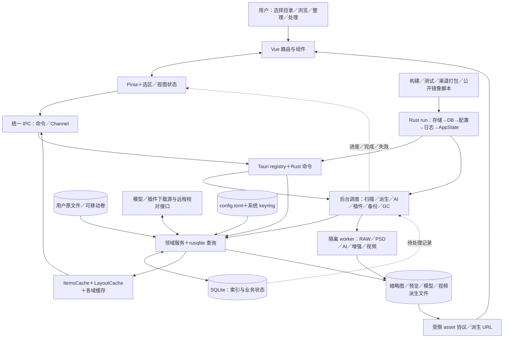

调度不是一个通用任务引擎：`tasks::spawn_all` 管日志批推送、卷在线对账、文件名排序预热、DB optimize 和缓存 GC；自动备份、exotic coordinator、video service 在组合根另外启动；前端还触发派生与 AI 恢复。`AppState::ai_yield_blockers` 让 AI 服从扫描／缩略图／派生／exotic／交互；派生在交互时保留低并发推进。此分工已经实现，跨域完成条件仍需集中验证。

## 4. 主要流水线总览

| 编号 | 流水线 | 主要入口与产出 |
|---|---|---|
| F01 | 启动、配置、退出 | 程序入口 → 可用窗口／配置／后台服务，退出检查点 |
| F02 | 扫描与增量补全 | 添加或重扫目录 → 媒体索引、尺寸／元数据、可用态 |
| F03 | 查询、布局与选区 | 路由／筛选／滚动 → 分组布局与可视条目／选择描述符 |
| F04 | 缩略图与缓存服务 | 视口请求／全量或增量生成 → 缩略图与状态回填 |
| F05 | 后台派生 | 入库通知／开关／手动重建 → 封面、关键帧、AI 缓存 |
| F06 | 图像、视频与音频查看 | 打开条目 → 原件或可播派生物、播放进度与字幕 |
| F07 | 文档阅读与校对 | 打开文档／校对 → 章节／页面、书签、校对版本 |
| F08 | 图片编辑与色彩查看 | 编辑另存／目标色域切换 → 新文件再索引或缓存派生 |
| F09 | 标记、合集与文件操作 | 用户整理动作 → DB 标记或文件系统与索引共同变化 |
| F10 | 导出 | 选择与预检 → 独立导出目录及 manifest |
| F11 | 备份、恢复与存储连接 | 手动／定时任务 → 备份包或恢复后的工作库；根目录重关联／后端连接测试 |
| F12 | 精确去重与重复镜头 | 分析 → 摘要／重复组／关联文件夹浏览 |
| F13 | 语义分析与搜索 | 批分析／查询文本 → embedding、相似度结果与画廊 |
| F14 | 人脸与人物 | 分析／人工维护人物 → 人脸、聚类与人物照片视图 |
| F15 | OCR | 对图片提取文字 → 文本结果 |
| F16 | 降噪与超分 | 选择模型与参数 → 增强结果／另存 |
| F17 | 模型、插件与 worker | 下载／安装／激活／任务派发 → 就绪能力与处理结果 |
| F18 | 构建、发布与镜像 | 本地命令／CI／tag → 校验结果、安装包／公开源树 |
| F19 | 日志与诊断 | 前后端日志／用户导出 → 日志窗口与诊断包 |

未发现作为产品入口的通用 CLI／业务 REST API／自治 Agent／跨设备同步流水线。仓内 CLI 是开发、模型／插件工具和验证程序；卷轮询与配置 watcher 属本机状态同步，不等于目录实时索引或云同步。

## 5. 各流水线架构图与调用链

### F01 启动、配置与退出

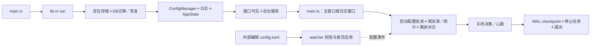

输入为持久目录、数据库与配置；输出为窗口和可运行的领域服务。`lib.rs::run` 先完成状态装配再显示窗口；`AppSidebar.vue:46` 读取扫描根和统计，`App.vue:307` 批量水合启动配置、注册心跳，再启动恢复动作。配置错误保留坏文件并以默认值启动，运行中语法错误保持上一份有效配置。`lifecycle.rs` 用前端心跳和有界宽限避免 WebView 失联后窗口无法关闭，退出显式 WAL checkpoint。基本闭环；各后台任务的恢复是否公平并非由本流程统一保证。

### F02 扫描、快速重扫、元数据与卷状态

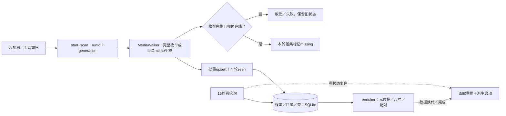

入口与链：[start_scan](C:/workspace/scrollery/src-tauri/src/ipc/scan_commands.rs:610) → `run_fast_scan_with_generation_and_state` → `MediaWalker` → `upsert_fast_scan_item` → 缺失差集 → `run_enrichment_with_generation`。输入根路径及扫描参数，输出索引、尺寸／EXIF 等元数据、Live Photo 关联、进度与 online/offline/missing 状态。写入按批事务提交并使布局数据版本失效。

保护已有实装：按根代次与写闸门拒绝旧任务；取消／不完整遍历不执行危险差集；临时 seen 表按运行身份隔离并清理；重新发现文件可恢复可用态。已有快扫基线、祖先目录更新时间及运行代次测试。基本扫描闭环成立，但 **quick 的目录 mtime 剪枝不是内容新鲜度保证**；就地修改内容而目录 mtime 不变时，仍需要完整扫描。卷 watcher 只检查卷／路径在线，不监听媒体文件变化。Windows 有卷身份支持，非 Windows 挂载点处理需完善。

### F03 普通搜索、布局、虚拟浏览与选区

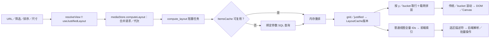

核心证据：`useJustifiedLayout.ts:64`、`mediaStore.ts:183`、`ipc/layout_commands.rs:234`、`layout/items_cache.rs:474`、`useGalleryVirtualEngine.ts:32`。普通搜索走参数化 SQL；语义搜索把结果表接入查询。Rust 保存瘦几何、条目载荷与排序索引，前端按视口呈现。`view_to_sql` 与布局查询共用谓词，已有 `view_layout_parity.rs` 等一致性测试。

异常处理包括布局版本校验、前端最新请求生效、30 秒看门狗、离屏推迟重算、切换滚动引擎保留逻辑位置。当前两类布局已接通，Canvas 仍是实验开关；横向实验室另外维护缓存与路由。`useViewIds.ts:36` 仍传全量 IDs 并构造 Map，因此“虚拟化”不意味着所有层都与库规模无关。两套前端视图 DTO 构造仍分别位于 `useJustifiedLayout` 与 `useViewDescriptor`。

### F04 缩略图生成、选档与缓存恢复

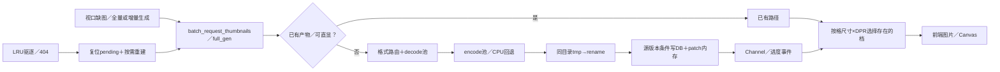

[batch_request_thumbnails](C:/workspace/scrollery/src-tauri/src/ipc/thumbnail_commands.rs:139) 先命中状态／路径快线，冷格式交给 exotic，其余进入解码、编码和延迟 CPU 回退池；全量与增量入口另有管理流程。输入条目 IDs、目标尺寸与源版本，输出 WebP／直显路径和逐条结果。`flush_thumb_results` 以 source_revision/cache_key 条件写入，防止旧像素覆盖新源。坏图、panic 与格式失败有终态；缓存 GC 回写 DB 的待生成状态，缺图还可由前端请求自愈。

服务选档只选择**已经存在**的档位；只有 512 档的旧库不会因为一次 60px 浏览自动补出 64 档。这是性能能力的边界，不是必然破图。当前取行 async 命令仍直接进行目录探测，载荷读锁内还可执行文件存在性检查；需把实际磁盘成本计入滚动性能。单个慢文件能否被有界中断尚缺真机证据。

**GPU 判断**：`engine/gpu/wic_engine.rs` 使用 WIC 解码与 BitmapScaler，没有在这条缩略图路径实现 CUDA／D3D 图像处理。不能凭目录名宣称 GPU 解码已完成。AI worker 的 DirectML 等推理加速是另一条真实实现；WIC 系统 codec 是否内部加速也不能由此源码统一保证。

### F05 封面、关键帧与其他后台派生

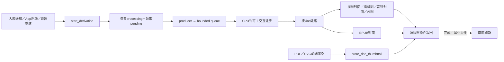

[derive/pipeline.rs](C:/workspace/scrollery/src-tauri/src/derive/pipeline.rs:75) 具有生产、消费、批写三段；`kind::is_implemented` 决定可领取种类。输入待派生记录、配置与源快照，输出封面／关键帧／AI 缓存以及任务状态。扫描、缩略图与用户交互通过优先级控制，交互时派生仍可低并发推进。

启动恢复孤立 processing，停止重排在途记录，完成只清本代 token。视频封面／关键帧当前主要有 Windows 路径；AudioMeta、VideoPlayable 是按需任务，不等于常驻全库 backfill。PDF／SVG 缩略图依赖挂在 App 上的 `DocThumbRenderer`，所以此处不是纯后端离线流水线。核心派生已接通，平台与格式矩阵需要单列验收。

### F06 图像、视频与音频查看

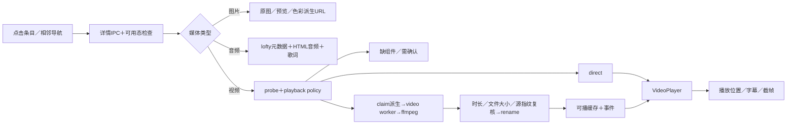

图像经 viewer store 与详情请求代次、受限 asset URL 展示；支持先原图后色彩派生、坏派生回退原图。音频详情一次解析标签和封面，并支持内嵌／同目录歌词。视频核心是 [resolve_video_playback](C:/workspace/scrollery/src-tauri/src/ipc/video_commands.rs:154) → `playback_orchestrator::resolve_impl` → policy → direct 或 worker 派生；不是全部格式无条件交给浏览器。

视频派生先原子认领、限制空间，再经时长、非空、源指纹复核后发布。取消能退回可重试状态；使用中的缓存免驱逐。前端区分 preparing、needsComponent、needsHevcExt、needsConfirm 等状态，有迟到结果守卫。普通播放主链已接通，但特殊视频依赖组件／系统 codec。FFmpeg 默认下载坐标与可执行文件名偏 Windows，不能等同于多平台可播闭环。

### F07 文档阅读、保存与远程校对

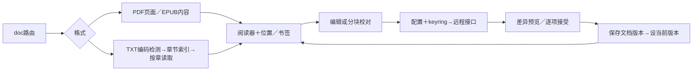

TXT 链是 [get_text_book_index](C:/workspace/scrollery/src-tauri/src/ipc/doc_commands.rs:591)／`get_text_chapter` → 编码检测 → 章节规则与无目录兜底 → 字节偏移读取；已有多编码、换行、章节与偏移测试。PDF 使用 pdfjs-dist；EPUB 使用 vendored foliate-js，TXT／Markdown 经 `syntheticBook.ts` 适配章节阅读接口。`BookReader.vue` 中的实际 import／makeBook 调用比残留 epub.js 注释更可信。不能由 TXT 测试推断 PDF／EPUB 的大文档表现。

远程校对通过 `proofread_remote` 和 `proofread_chunk` 使用用户配置的接口及系统 keyring 凭据，前端分块、比较差异、接受后保存版本并切换当前版本；请求具有超时与失败返回。阅读／版本管理代码闭环已接通，校对依赖外部服务，本次未提交真实文稿或调用付费接口。大文档渲染、编辑恢复和不同格式的真机体验仍需验证。

### F08 图片编辑另存与查看色彩转换

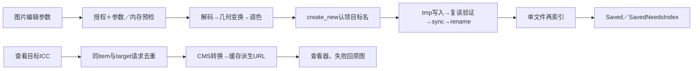

[save_edited_image](C:/workspace/scrollery/src-tauri/src/ipc/edit_commands.rs:150) 使用文件任务门闩与 RAII 释放，校验操作和内存后执行几何／调色。写出阶段独占目标名、复读验证元数据、原子替换；保存成功但索引失败返回 `SavedNeedsIndex`，避免让用户误以为图片没保存。它是另存再入库链，不能自动称作覆盖原件的无损编辑历史。

查看色彩转换在 `viewer_color/render.rs::ensure_derivative` 实作，ICC 从配置读取，同一 item/target 合并请求；移动端返回不启用，动画格式亦有保守限制。已有 CMS 参考值和 ICC 字节测试。编辑与色彩处理已实现，前者受授权边界约束；WIC 解码当前不返回 ICC，跨格式色彩与方向一致性仍是实际缺口。

### F09 标记、合集与文件操作

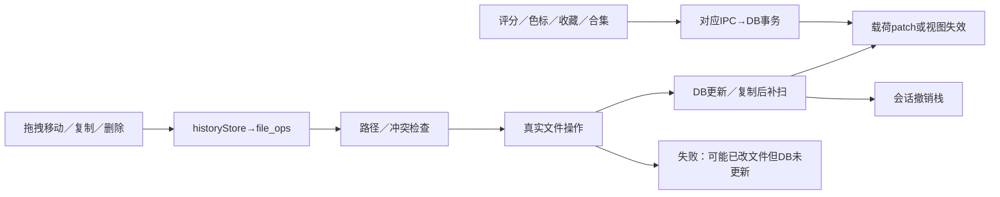

标记与合集链有真实 store、IPC 和 DB 查询，敏感筛选需重新查询，普通展示可原地 patch。普通软删除是 DB 状态变化；系统回收站与不可逆物理删除要看各自命令，不能混为一个“删除”。

[move_directory](C:/workspace/scrollery/src-tauri/src/ipc/file_ops_commands.rs:664) 校验目录关系，真实搬移后改写子树与缓存键；跨卷 helper 可复制后删除。单项移动和 DB 感知复制又有独立路径。目录复制先复制文件，再由 `historyStore.execCopy` 启动目标根扫描。撤销记录在会话内；不能作为崩溃后的持久补偿账本。

**这条链的完成度低于备份／导出**：目录跨卷搬移后媒体卷身份未同步更新；真实搬移成功而后续 DB 失败没有等价的“已搬移待修复”结果；扫描与部分文件操作的协调也需场景验证。故日常路径接通，故障恢复不能判完整。

### F10 导出

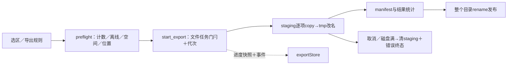

[export/core.rs::run_export](C:/workspace/scrollery/src-tauri/src/export/core.rs:168) 输入选择描述符、目标目录和命名规则，输出导出目录及 manifest。预检和正式执行分开，库内目标需显式允许；逐项临时文件与最终名字隔离，末尾发布整个目录。进度快照先于事件，迟到取消和终态由代次校验，磁盘满／取消清理 staging。代码链闭环，导出是整理结果复制；不应从它推导出跨设备同步或任意格式批量转码。

### F11 备份、恢复、目录重关联与存储连接

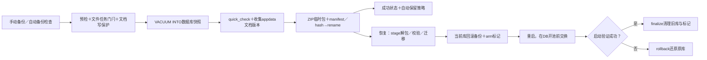

链路：[start_backup](C:/workspace/scrollery/src-tauri/src/ipc/backup_commands.rs:234) → `backup/core.rs::run_backup` → 快照、哈希与打包；恢复为 `restore_stage` → `arm_restore` → 重启 → [perform_swap_at_boot](C:/workspace/scrollery/src-tauri/src/backup/swap.rs:162) → `finalize_restore_verified`／`rollback_restore_at_boot`。自动备份默认不运行，用户启用后首检延迟 120 秒、之后每小时检查，距上次成功不足 24 小时不再执行；繁忙时让步。输入指定备份目录或备份包，输出备份记录或替换后的库与 appdata 文档版本。

**包的真实范围**：`db/scrollery.db`、属于 appdata 的 `documents/**` 与 manifest；不包括原媒体、缩略图／模型缓存、系统 keyring、外部存储的文档版本，**也未打包当前设置文件 config.toml**（见 `backup/core.rs` 的 ZIP 条目构造与 `backup/manifest.rs`）。DB 内 app_config 状态键不能等同于完整用户设置。原件丢失不能靠重新扫描恢复；扫描只能重新索引仍存在的原件。

取消与磁盘错误清理临时产物；恢复拒绝高于当前 schema 的包，旧库先迁移到 v32；阶段标记允许启动时回滚。`backup/swap.rs` 的崩溃阶段、重复启动、`rollback_at_boot_restores_original_and_clears_marker` 等测试和实际引导调用共同证明恢复机制有实现。本次没有真正重启应用执行恢复，因此是代码／测试闭环，尚非整机恢复演练完成。

本地根目录重关联使用 `scan_commands.rs::relink_scan_root` 的路径检查与样本验证后更新索引定位；它不同于 F09 的物理目录移动。原生网络存储目前止步如下：

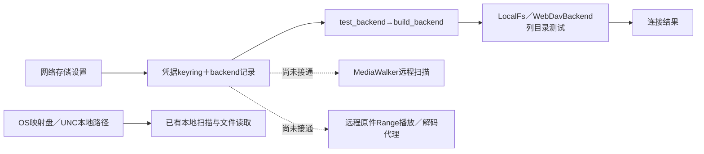

证据：[storage/mod.rs](C:/workspace/scrollery/src-tauri/src/storage/mod.rs:53) 有 `StorageBackend` 的 list_dir/stat/read_range 与 WebDAV 实现，但生产 `build_backend` 调用集中在连接测试，扫描根仍沿本地路径。连接失败可返回明确错误并重试；没有主链接入就没有网络任务续传／索引恢复闭环。故原生 WebDAV 为部分实现，OS 挂载路径则可以进入本地流程。

### F12 精确去重分析与重复镜头浏览

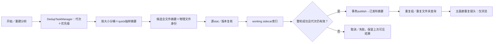

调用链为 `start_dedup_analysis` → [DedupTaskManager::start_with_state_and_app](C:/workspace/scrollery/src-tauri/src/dedup/task.rs:824) → 分桶、quick、exact、源验证 → [publish_dedup_run](C:/workspace/scrollery/src-tauri/src/db/queries/dedup.rs:588) → duplicate lens。输入当前索引中可用文件，输出可发布摘要与重复组／文件夹关系；Live Photo 同伴参与逻辑单元判断，并非只按单个文件的缩略图相似度判重。

本轮处理中与已发布结果隔离，取消／旧代任务不得覆盖新终态。`dedup/task.rs` 的 `stop_then_restart_does_not_publish_old_terminal_state_or_clear_new_run`、`stopped_run_never_publishes_epoch_hook`，以及 `db/queries/dedup.rs::lens_sees_only_successfully_published_results` 有针对性证据。quick 输入仍受 F02 的索引新鲜度限制；不应承诺扫描遗漏内容变更时去重结果自动刷新。

**分析→浏览闭环已接通；清理闭环没有接通。** `useLensBrowseGate.ts` 与 `MediaGrid.vue` 明确禁用重复镜头的选择、拖放、上下文菜单与批操作；旧 `/duplicates` 路由转向主画廊。注册表内还存在历史预览／软删除命令，也不能据此称为当前可用的物理去重清理产品。

### F13 本地语义分析与搜索

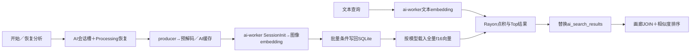

执行链为 [ai/worker_pipeline.rs](C:/workspace/scrollery/src-tauri/src/ai/worker_pipeline.rs:48) 与 [ai/search.rs](C:/workspace/scrollery/src-tauri/src/ai/search.rs:106)。批分析恢复孤立 processing，源 cache_key 校验后写回；worker 会话过期／进程错误有有限重建重试，结束释放会话。语义搜索把查询编码后，对按模型载入的 f16 向量做全量点积，结果写共享表后重排画廊。**没有接入 ANN**；`vector_store.rs` 的抽象及 BruteForceStore 只有自身测试消费者。

有可配置的模型发现、下载、离线已装模型识别与切换，因此属于已实现、依赖模型的闭环。并发查询的前端 searchToken 只保护展示回包，后端共享结果表仍没有等价的查询代次提交条件；最新查询／切模型／迟到旧结果的跨层一致性要补测试和修正。前端实际已有 `searchError`，不能称所有搜索失败都只是静默日志。

### F14 人脸、聚类与人物视图


[face_pipeline/mod.rs](C:/workspace/scrollery/src-tauri/src/ai/face_pipeline/mod.rs:84) 启动时恢复任务、核对人物计数及未聚类脸；dispatcher 分批推理，writer 分不同节奏保存脸与运行聚类。人物路由有真实照片查询。脸写入后、聚类前崩溃由下次对账补齐，属于有恢复设计的闭环。

AI 与人脸共享会话级 owner，CPU 许可与 GPU 批许可各管不同资源。App 同时触发两者自动恢复时，失败方没有自动排队；这是调度缺口，不是互斥锁本身应被删除。准确率、不同模型和多人归属体验不由单元测试数量证明。

### F15 OCR


[ocr_commands.rs](C:/workspace/scrollery/src-tauri/src/ipc/ocr_commands.rs:253) 提供图像与帧入口，经授权、模型准备、worker OCR batch 返回文本结果；模型清单有下载坐标及校验值。worker 的 OCR 会话与 CLIP/face 会话管理分开，错误有明确 code。处理链已接通，但用户可用性取决于所用发行构建的授权与模型；本次未验证生产激活／真实图片识别。

### F16 降噪与超分

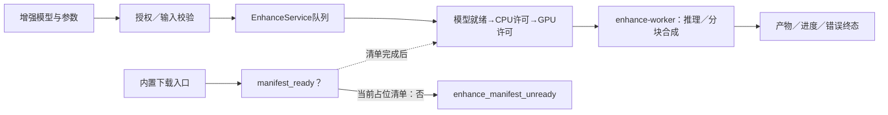

队列、进程会话、分块模型处理、取消与错误状态均已有实现，主要入口是 [enhance_start](C:/workspace/scrollery/src-tauri/src/ipc/enhance_commands.rs:210)。但 [enhance/registry.rs](C:/workspace/scrollery/src-tauri/src/enhance/registry.rs:22) 仍使用 PENDING_USER_REPO、空 hash 与零大小，`enhance_manifest_ready` 明确阻止下载。因而**内核已实现、默认用户获取模型再使用的闭环未完成**；手工放模型或开发环境成功不能替代发行验收。

### F17 模型下载、插件安装、授权与 worker 监督

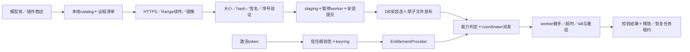

模型公共下载器使用 .part 续传、大小／SHA 校验和最终改名；.part 的存在本身是恢复功能，不应被当作垃圾文件缺陷。插件链为 [install_exotic_plugin](C:/workspace/scrollery/src-tauri/src/ipc/exotic_commands.rs:594) → Registry 验签 → staging → quiesce → installer → resume；监督链有 worker 身份／能力握手、超时回收与租约恢复。隔离进程是真实存在，但不能仅凭子进程宣称完整 OS 沙箱；不同 worker 的父进程退出处理与视频 ffmpeg 子进程管理不同。

默认 registry 地址为 .invalid，支持运行时与构建时注入；pro/trust 信任根同样支持编译期注入，debug 还可使用内测配置。故**协议、安装与授权代码已有闭环，默认发行配置／生产服务闭环尚不能确认**。msstore／steam 渠道有互斥构建与不支持的安装桩；不等于商店购买／更新已上线。free-stub、公开 keyring 实现、私有 pro 组合各有用途，不能直接按“重复授权代码”删除。

### F18 本地开发、CI、发布与公开镜像

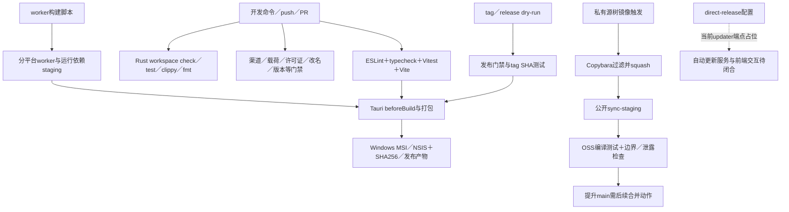

输入为源树、lockfile、渠道 feature／Tauri overlay、工具链和供应配置；输出为编译结果、worker、安装包或公开投影。`package.json` 的 `npm run build` **只构建前端**；完整桌面构建为 Tauri 流程。`scripts/build-raw-worker.mjs` 使用 GNU 工具链，RAW worker／probe 独立 workspace，不被根目录 `cargo test --workspace` 自动覆盖；AI／video worker 有独立构建脚本，不能将脚本存在当作产物已验证。

私有 [ci.yml](C:/workspace/scrollery/.github/workflows/ci.yml:115) 同时配置 Windows 与 Linux check/test，前者本次已在本机验证，后者只是核实配置而未查询远端运行记录；可选 smoke job 使用 release exe。公开 [oss-gate.yml](C:/workspace/scrollery/.github/workflows/oss-gate.yml:114) 对 sync-staging 做 Linux 编译与测试及公开边界校验。`copy.bara.sky`／`.github/workflows/sync-oss.yml` 负责过滤 pro／内部内容、锁文件与公开投影；不是资产同步，也没有在当前审查中执行推送。

[release.yml](C:/workspace/scrollery/.github/workflows/release.yml:68) 有 NOTICE／SBOM、测试、Tauri MSI／NSIS、哈希与产物步骤。失败时 job 中止，可修正源码／输入后重跑；没有本次安装包就没有安装／升级／卸载恢复证据。**当前 NOTICE 与改名门禁本地实跑为红，因此“仓库可直接发布”不成立**。公开发布与私有 CI 门禁并不完全相同，不能假定某一门成功等于所有发行形态成功。

direct-release 的 updater overlay 仍为 `updates.scrollery.invalid`，且未发现完整前端更新交互入口。是否配置生产 updater、签名与插件服务，取决于实际选择的发行渠道；免费版公开发行不应被未承诺的付费／自动更新功能绑住。Steam／Microsoft Store 的 feature 与 provider 桩不构成商店交付闭环。macOS／移动端没有对应完整发布工作流。

### F19 日志、状态观测与诊断导出

```mermaid
flowchart LR
  A[前端异常／业务日志] --> B[日志IPC批提交]
  C[Rust tracing＋AppError] --> D[统一日志信封]
  B --> D
  D --> E[按日JSONL＋空间预算]
  D --> F[订阅环形缓冲]
  F --> G[100ms批事件→独立日志窗口]
  E --> H[分页读取／直方图]
  H --> G
  E --> I[诊断导出：脱敏→tmp→rename]
```

[logging.rs](C:/workspace/scrollery/src-tauri/src/logging.rs:499) 与 [log_commands.rs](C:/workspace/scrollery/src-tauri/src/ipc/log_commands.rs:349) 已接通文件日志、实时窗口、查询和诊断包。重复错误压缩、会话／操作关联、大小预算与导出脱敏都已有代码与测试。日志用来诊断，业务恢复依赖 SQLite 与各域恢复记录；没有日志重放不是缺陷。

局部缺口：`clear_logs` 在 async 命令中直接枚举／删除并吞掉文件删除错误；大日志“分页”内部仍整文件读取。它们影响可靠性与规模，不代表整个日志子系统只是骨架。

## 6. 当前完成度与缺口

### 6.1 按能力划分，避免单一完成百分比

下面“已完成且可用”限定为已有可达入口、正常链路及相应自动测试支持；**不表示本次已安装运行验收**。需要原生环境、模型、授权或外部服务的能力另外注明。不能从数千条底层测试推出所有 UI／发行路径都可靠。

| 等级 | 能力 | 依据与具体边界 |
|---|---|---|
| 已完成且可用（代码／自动测试层） | 本地扫描、增量补全、常规查询与两类布局、普通标记／合集 | scan_commands→fast_scan→DB→compute_layout 可达；扫描代次、布局／选择谓词一致性测试已在通过的工作区套件内；quick 不保证发现全部文件内容修改 |
| 已完成且可用（代码／自动测试层） | 精确去重分析与重复镜头浏览 | working→publish→lens；取消不发布、只见已发布结果有专门测试；仅限分析与浏览 |
| 已完成且可用（代码／自动测试层） | 导出引擎、备份／启动恢复内核、TXT 编解码与章节读取 | export/core、backup/core/restore/swap、reader 与 doc_commands 有实际提交／取消／回滚路径和测试；真实安装包操作与重启恢复本次未跑 |
| 已实现但需完善 | 完整桌面日常体验：浏览、缩略图、派生、多媒体查看、文档版本与日志 | UI→IPC→结果已接通；格式／大库／设备矩阵、原生端到端、热路径 IO、WIC ICC 尚需补齐 |
| 已实现但需完善 | 文件移动／复制与撤销 | 常规路径已有结果，跨卷身份和搬移后 DB 失败缺完整恢复；会话撤销不能覆盖崩溃 |
| 已实现但需完善 | 语义分析／搜索、人脸、OCR、编辑另存、插件安装 | 编排与 UI 已接通；真实模型／worker／授权的发行可用性未验；AI／face 自动恢复有争用后停滞问题 |
| 已实现但需完善 | CI 与 Windows 发布流程 | 工作区检查大部通过，两个静态门为红；安装包载荷层、安装／升级／卸载／首启仍未验证 |
| 部分实现 | 降噪／超分 | worker、队列和 UI 已有，内置下载清单被 readiness 守卫阻断，用户模型获取闭环未成 |
| 部分实现 | 原生 WebDAV | 后端 CRUD／连接测试与 read_range 已写，scanner／远程 asset 流未接通 |
| 部分实现 | macOS／Linux 产品交付、direct 自动更新 | Linux CI 编译面真实存在；macOS 有平台分支；缺完整多平台交付验证，direct updater 端点占位且交互未接通 |
| 仅骨架／设计 | 移动端完整产品、Steam／Microsoft Store 授权交付 | 移动入口和 cfg 分支不能替代原生项目与发行链；商店 provider 返回未授权／不支持，Steam 启动仍为桩 |
| 尚未形成流水线 | 跨设备资产同步、通用 REST／自治 Agent、产品 CLI | 未发现对应用户入口、状态协议与执行闭环；属于未实现能力，不是应当修复的隐藏故障 |
| 遗留或疑似废弃 | vector_store 抽象、孤立事件常量、旧去重操作入口与部分注释 | 见 §7；先核查动态注册与外部消费者，再移除。Canvas／bucket／横向实验室、AI core 再导出和 free/pro 组合不应归入这一档 |

### 6.2 本次实际验证

验证均基于 `2118ff52026a453bf8ac69dd58c380c46d7c480c`，Windows 本机、现有依赖与环境。没有执行格式化修复或更新生成文件。

| 检查 | 实际结果 | 能证明什么／不能证明什么 |
|---|---|---|
| `npm test` | 156 文件、1,781 测试通过 | 前端当前自动套件通过；不等于 WebView 与 Rust 真联通 |
| `npm run typecheck`／`npm run lint` | 均 exit 0 | 类型／ESLint 通过 |
| `npm run build` | exit 0 | Vite 产物可生成；不是桌面安装包 |
| `cargo check --workspace --tests` | exit 0 | 当前平台工作区及测试代码可编译 |
| `cargo test --workspace --locked` | 1,495 通过、12 忽略、0 失败 | 包含主库 1,262 通过／8 忽略；忽略项、独立 RAW workspace、真实模型测试不因此算通过 |
| `cargo clippy --workspace --locked --all-targets -- -D warnings` | exit 0 | 当前编译配置静态检查通过 |
| `cargo fmt --all -- --check` | exit 0 | Rust 格式检查通过，未改文件 |
| 渠道包、路径卫生、主题对比／调色板、exotic 协议、版本同步检查 | 通过 | 对应脚本静态约束满足；不等于商业激活／平台运行通过 |
| 安装包内容检查 | staging／配置层通过；安装包载荷层跳过 | 本机没有安装包，跳过层不能记为通过 |
| `node scripts/generate-notice.mjs --check` | **exit 1** | `NOTICE.md 与 lockfile 不同步`；例如 MIT 汇总现有 215、应为 249；影响 ci.yml:107、release.yml:70 |
| `node scripts/check-rename-gate.mjs` | **exit 1** | `scripts/bench/canvas-realapp-bench.mjs:123` 仍含受门禁拦截的 picasa 旧词根；影响 ci.yml:174 |
| `worklog-kit check` | **exit 1，21 处既有强制违规** | 旧文档的 status／type／id／line 等元数据不合当前配置；另有 149 条 baseline 豁免挂账，豁免不等于无问题；本次新报告／分片／收口记录未报违规 |
| `worklog-kit index check` | exit 0 | 本次规划归档与目录索引一致；报告19条流水线／21个Mermaid图块及31个源码链接目标已作结构核验，未声称图形渲染真机验收 |
| Tauri 打包／安装与真机端到端、远端 CI 历史、真实模型／服务 | **未执行** | 没有据此作可发布／跨平台／商业可用宣称 |

两个红门是本次实际失败，不是从 TODO 推测的问题。其他脚本通过也只覆盖各自检查层；未重跑全部变体、全部忽略测试或每个外部工具。

### 6.3 平台与发行边界

| 目标 | 已有事实 | 当前不能确认的部分 |
|---|---|---|
| Windows | 本次实际编译与自动测试通过；WIC、卷身份、视频服务、worker 和 MSI／NSIS 发布代码存在 | 安装包首启、真实文件库／模型、升级与卸载、异常中断演练 |
| Linux | 私有 self-hosted Linux 与公开 ubuntu-latest 的 cargo check/test 均有 workflow；部分非 Windows实现 | 未读取本次远端运行结果；媒体工具、卷挂载语义和发行包闭环 |
| macOS | 窗口、文件树、exotic 架构、系统命令存在平台分支 | 未在 macOS 编译运行；无完整打包／签名／公证工作流证据 |
| iOS／Android | mobile entry／cfg 与禁用部分桌面功能的分支 | 未见原生生成工程和完整构建发布链；不能标为已支持的产品 |
| free／direct／商店 | 默认免费公开构建及 direct overlay 存在，渠道 feature 互斥有校验 | 商店支付授权未成；direct 插件服务／信任根需按构建注入，updater 未闭合；免费发布不以这些未承诺能力为前置 |

## 7. 关键架构与工程问题

### 7.1 确认的问题

**A. 目录跨卷移动没有完整更新资产身份。** [move_directory](C:/workspace/scrollery/src-tauri/src/ipc/file_ops_commands.rs:733) 允许物理跨卷 fallback，后续更新 directories 的 root_id／rel_path 及 media 的 cache_key／thumb_path，却没有同步 media.volume_id 等卷定位信息。若源、目标属于不同已登记卷，移动后旧卷下线，[bulk_set_availability](C:/workspace/scrollery/src-tauri/src/db/queries/storage.rs:237) 仍按旧 volume_id 把已移到在线目标卷的条目标为 offline。扫描 upsert 的 COALESCE 只能填 NULL，不能修复既有错误的非 NULL 卷身份。影响是错误可用态、后续索引对账与恢复；本次未执行真实跨盘搬移，结论来自完整写入／消费调用链。不要将其夸大为已经发生原件丢失。

**B. 文件已搬但数据库失败时，错误与恢复信息不足。** 同一函数先完成 FS 操作，再开启 DB 事务；后者失败只沿 `?` 返回错误。tree snapshot 会清理，但没有持久化搬移阶段或与编辑 `SavedNeedsIndex` 等价的明确结果，前端成功后才记录 undo。复制目录又依赖后续扫描入库，扫描中止可留下“文件存在、库未入”的状态。手动重扫可修复一部分索引，不能代替保留条目 ID／标记的完整恢复。应建立简单、可测试的文件操作结果与恢复契约，无须由此引入分布式事务或全仓事件溯源。

**C. AI 与人脸同时自动续跑时，竞争失败的一方可能一直停着。** `App.vue` 并行触发两者恢复；[useAnalysisController.ts](C:/workspace/scrollery/src/composables/useAnalysisController.ts:191) 仅在启动恢复点尝试，失败只交给 onError。会话 owner 拒绝竞争请求后，没有任务完成事件唤醒／排队重试，running 为 false 时轮询也不帮助它启动。持久 active 意图与实际执行脱节。这里需要补续跑语义，而不是合并三个职责不同的会话／CPU／GPU 资源门。

**D. 快速扫描的名称容易被误解为完整增量一致性。** `scanner/fast_scan.rs::decide_dir_pruned_at` 按目录 mtime 跳过整个目录。原文件就地更新且目录 mtime 不变时，连文件 stat 都不会走到；文件 mtime 是否变化不改变这个漏检条件。没有库目录 watcher 自动弥补。精确去重、缩略图及 AI 的源版本守卫只防“已经被发现的新源”被旧结果覆盖，不能发现未扫描到的变化。应明确 quick／完整重扫的用户契约，再按需求补监听。

**E. 滚动取行仍有同步磁盘探测，普通视图仍全量物化 IDs。** [thumb_serve_for](C:/workspace/scrollery/src-tauri/src/ipc/layout_commands.rs:883) 在 async 取行入口探测多档目录；`ItemsCache::hydrate_rows` 持读锁期间可检查文件存在性。慢盘、离线映射盘与大量逐项 stat 会扩大延迟和锁占用。`useViewIds` 全量数组＋Map 另占 O(N) 前端内存。这里有明确源码成本，但本次没有性能基线，不能给出虚构卡顿比例或“百万库已验”结论。

**F. 当前发布门与依赖状态脱节。** NOTICE 生成物和改名残留使现有 CI／发行步骤失败。独立 RAW workspace、被忽略的推理测试、配置／staging 层通过而安装包层跳过，又构成验收盲区。最大的工程缺口不是“没有测试”，而是自动测试强在领域逻辑，发行产物和跨域故障路径缺同等证据。

文档治理另有独立旧账：`worklog-kit check` 报 21 处既有强制违规，主要是旧设计／规划／收口文件还使用旧中文枚举或缺少 id／line／线实体。此次仅借门禁检查元数据，未把这些文档正文当作能力证据，也未扩大范围修旧内容或重置 baseline。

### 7.2 需验证的并发风险，尚非复现故障

语义搜索前端有 [searchToken](C:/workspace/scrollery/src/stores/aiStore.ts:127) 与 searchError，不能说它没有旧响应保护或错误呈现。但后端 [semantic_search_with_vector](C:/workspace/scrollery/src-tauri/src/ai/search.rs:106) 把结果写进共享 ai_search_results，提交时没有查询代次条件；模型缓存／结果表／当前视图的身份约束未统一。两个请求反序完成时，前端丢掉旧响应并不自动撤销它的 DB 写入。需要用受控 A／B 交错及模型切换测试复现或排除，而不是直接宣布用户结果已损坏。

同样，布局代次、data_version、源 revision、scan generation、dedup epoch 与数据库生命周期各解决不同问题，现有实现已有大量保护；待补的是跨组合场景验证和少量公共结果契约，不是全部换成一个 generation 字段。

### 7.3 重复、并存与遗留的具体分类

| 位置 | 判断 | 建议 |
|---|---|---|
| useJustifiedLayout／useViewDescriptor | 当前视图／筛选 DTO 构造重复，有漂移成本 | 以已有后端共享谓词与 parity 测试为边界，抽出一份前端规范描述；保持用户可选选区模式解耦 |
| full_gen／incremental_gen／视口缩略图 | 执行入口并存，部分状态管理分开；底层路由与处理引擎已共享 | 比较取消、源变化和完成事件，不因入口多就强行合并所有任务 |
| 传统／bucket 滚动，DOM／Canvas，HGalleryLab | 可达的运行模式或实验，不是死代码；组合提高维护与验收成本 | 记录支持矩阵和实验退出标准，再决定保留；不擅自删用户选项 |
| ai/vector_store.rs | BruteForceStore／trait 主要为自测与预留；实际搜索用 search.rs 的 f16 缓存与 Rayon | 删除无生产消费者的预留层或明确隔离；ANN 需测量后立项 |
| 旧去重预览／apply softdelete IPC | 命令还在注册，但重复镜头已 browse-only | 核实外部消费者后清理，或等清理产品方案明确再接线；不能作为已交付能力 |
| db:media_updated 常量 | 源码搜索仅声明，无生产发射／监听 | 可清理的孤立常量 |
| 单条缩略图取消 IPC | 后端保留，前端当前不调用；前端有复用 inflight 的明确设计 | 不应称为正在发生的取消集合泄漏；按实际 API 需求清理或解释 |
| ai-core 薄再导出、free-stub／pro、系统 keyring | 推理隔离与构建组合的有效边界 | 保留职责，不当作两套生产 AI／授权实现删掉 |

### 7.4 文本与真实实现的差异

依用户要求，本次没有系统阅读旧 docs 的产品论述，也不对未读文档作“全量勘误完成”声明。已核实的差异足以说明为何需要以代码为准：

| 文本或命名 | 实际代码 | 本次裁定 |
|---|---|---|
| useGalleryVirtualEngine／galleryLayoutSource 的“仅 justified／grid 后续”注释 | compute_layout 已按 layout_mode 分 grid／justified | 注释过时，两类布局已接通 |
| BookReader 残留 epub.js 说法 | 实际加载 vendored foliate-js | 架构以 import 与调用为准 |
| ci.yml 顶部说 rust-linux 保留 ubuntu-latest | job 实际 runs-on 为 self-hosted Linux | 执行配置为准，公开 oss-gate 另用 ubuntu-latest |
| engine/gpu 路径及广义 GPU 图像管线表述 | WIC BitmapScaler 路径未实现 GPU 图像处理；AI worker 有真正推理加速 | 区分图像解码／缩放与模型推理能力 |
| backup 中“配置”若被泛指为全部设置 | ZIP 不含 config.toml，DB app_config 不再是全部设置来源 | 备份范围必须据清单解释，不能承诺完整环境迁移 |
| 必需治理文本描述中文 schema | .worklogrc.jsonc v5 使用 ASCII status／type／disposition | 本次新记录以实际校验配置为准；未展开旧 docs 治理清理 |

其他应单独登记的能力边界：WIC 返回 `icc: None`；FFmpeg 下载器默认 Windows zip／exe；增强 manifest 明确未就绪；插件 registry／信任根可注入，默认占位不代表所有内测构建均不可用。没有把这些差异一概升为 P0。

## 8. P0–P3 后续工作规划

以下是建议工作项，**本次未开始实现**。P0 指在继续依赖相关文件操作或发布前解决的阻断；P1 是主线可靠性与可验证性；P2 是后续整合与能力完善；P3 由真实需求触发。若决定立即交付付费增强或某个新平台，该能力自身的供应／发行缺口应提升为那次交付的 P0，不影响免费本地主线的判断。

### P0：先处理资产一致性与已红的交付门

| ID／任务 | 为什么做／涉及模块 | 前置依赖 | 明确完成标准 |
|---|---|---|---|
| P0-1 文件移动的身份、结果与恢复契约 | 修复旧卷身份、FS 成功但 DB 失败不透明；file_ops、扫描／卷、historyStore、相关 DB 查询 | 先补现有关键行为表征测试，确认同卷／跨卷／复制后补扫的各自语义 | 跨卷后卷身份、路径、原 item ID／评分等一致；源卷下线不误伤目标；注入 DB 失败／复制中断后明确显示真实文件位置与可恢复阶段；重试／重启恢复幂等；覆盖操作期间扫描竞争 |
| P0-2 修复当前两条红门 | NOTICE 不匹配和 benchmark 旧词根直接让现有门禁失败；NOTICE、canvas-realapp-bench、CI／release | 无；只按现有政策修正，不扩张改名范围 | 两条原始命令 exit 0；NOTICE 再生后无差异；工作区仅出现预期生成物／脚本变化；重新确认受影响 workflow 不再被这两项阻断 |

### P1：让主线状态和发布证据可靠

| ID／任务 | 为什么做／涉及模块 | 前置依赖 | 明确完成标准 |
|---|---|---|---|
| P1-1 AI／face 自动续跑与等待态 | 避免 active 意图因会话竞争变成永久暂停；App、useAnalysisController、AI／face owner 与完成通知 | 明确用户暂停与资源等待的差别，保留现有 CPU／GPU 职责 | 两者同时恢复时有明确等待态；先跑者完成后另一方自动运行；用户暂停不被误唤醒；取消／错误／重启下无双 owner、无饿死；受控测试覆盖两种抢占顺序 |
| P1-2 发行产物与原生端到端基线 | 补上单测无法证明的集成与分发；Tauri、workers、RAW GNU、smoke、bundle | P0-2；破坏性文件操作场景依赖 P0-1 | 固定 SHA 生成并检查 Windows 安装包，在干净测试库完成首启→扫描→缩略图→查看→标记→导出→备份→重启恢复；实际加载拟发布 workers；RAW 独立测试有明确 job；忽略项按条件列出，不记为通过 |
| P1-3 搜索提交身份与反序请求验证 | 前端 latest-only 不约束共享 DB 结果；aiStore、ai/search、结果查询／缓存 | 先写可控 A／B 反序、清空、切模型场景测试 | 只允许当前查询／模型身份提交或被当前视图消费；旧请求不能覆写新查询结果；清空后不会被迟到结果复活；错误信息与 loading 归属正确 |
| P1-4 源内容新鲜度契约 | quick 剪枝影响派生／AI／去重输入；scanner、重扫入口、源 revision 消费者 | 先确认产品要求是“快速目录发现”还是“保证内容更新” | 就地改内容且目录 mtime 不变的测试说明 quick 边界；完整扫描必能更新 revision 并使旧派生失效；UI 可明确选择保证内容更新的路径；再决定是否需要 watcher |
| P1-5 滚动取行的磁盘与锁开销 | 慢盘 IO 进入高频路径；layout_commands、ThumbServe、ItemsCache | 先采默认 DOM 与 bucket 的延迟／IO 基线 | 移出 async 执行器与载荷读锁内的重复 stat／目录探测，或用可失效缓存替代；验证删缓存／换盘仍能恢复；记录冷／热缓存及慢盘 p50／p95、锁等待与回归结果，不凭视觉感受验收 |

### P2：减少维护分叉，补清晰的产品边界

| ID／任务 | 为什么做／涉及模块 | 前置依赖 | 明确完成标准 |
|---|---|---|---|
| P2-1 视图描述与遗留代码收敛 | DTO 重复、全量 IDs 与多实验组合增加复杂度；gallery、selection、vector_store、旧 IPC | P1-2 基线；延续既有布局／选择 parity 测试 | 一份规范前端视图描述用于布局与选择；清理项有零生产消费者证据；保持用户选区模式独立；用 10万／100万规模夹具测 ID 内存和交互，再确定是否分段；实验模式有保留／退出标准 |
| P2-2 付费处理的实际供给与验收 | 增强 manifest 占位、生产 registry／keyset 需确定；enhance、OCR、模型商店、pro／trust、打包 | 先确定拟交付的付费能力与渠道；P1-2 的 worker 验收环境 | 发布真实 model URL／大小／hash；下载／续传／损坏校验／安装／授权／执行／另存全程通过；默认构建对未供给能力准确显示状态；若本轮要卖该能力则升级为发行 P0 |
| P2-3 备份范围与可迁移设置 | 用户易把数据库备份当整库／环境备份；backup、ConfigManager、设置 UI | 明确是否要备份 config.toml，保留 keyring／原件独立边界 | UI、manifest 与恢复说明一致；若纳入设置则有版本兼容和路径重定位测试；恢复演练明确哪些还需原媒体、模型或凭据，绝不把重扫当作丢失原件恢复 |
| P2-4 格式／平台能力矩阵 | WIC ICC 缺失、FFmpeg 下载偏 Windows、非 Windows 卷识别粗；engine、video/tools、volume_watch、capabilities | P1-2 默认 Windows 基线；明确下一目标平台 | 实际支持／降级／不支持各格式有可查询状态；WIC HEIC／AVIF 色彩用参考样本验证；目标平台只选择可执行的工具资产；离线与重新挂载测试通过；未验证平台不宣称完成 |
| P2-5 文档元数据门恢复 | 21处既有违规阻断独立docs门；相关旧文档frontmatter与缺失线实体 | 无产品代码前置；先区分真实活线与应归档快照 | 按实际v5配置修正21处报错，复跑check和index check；不改写未经源码核验的产品结论、不用重置baseline掩盖违规；149条既有豁免仍单独记账 |

### P3：有需求再扩展，不把预留架构当完成度

| ID／任务 | 为什么做／涉及模块 | 前置依赖 | 明确完成标准 |
|---|---|---|---|
| P3-1 原生 WebDAV 端到端 | 将已写接口变成真实资产源；storage、scanner、媒体路径、Range 代理 | 先确认 OS 挂载不足以满足需求；明确远程源版本、凭据与离线语义 | 后端记录→远程扫描→元数据／缩略图→图片／视频读取→断网恢复均可用；无本地绝对路径假设；恢复不重复入库，Range 校验正确 |
| P3-2 下一平台或商店渠道 | 当前移动端／商店桩不构成产品；原生工程、平台分支、provider、打包 | 选择一个目标及具体用户场景；P1-2 可复用验收清单 | 该平台可构建、安装、运行核心链，权限／存储／后台规则明确；商店渠道另验购买→授权→恢复购买→更新；一次交付一个目标，不同时铺开四端 |
| P3-3 超大库语义检索升级 | 实际为全量 f16／Rayon，是否需要 ANN 应由数据决定；ai/search、embedding 持久层 | 固定模型与真实规模的延迟／内存测量；P1-3 搜索身份正确 | 若线性检索超过约定预算，再引入可持久化索引；验证召回率、更新／删除／重建与模型切换；否则保留简单线性主流程并清理未用抽象 |

## 9. 推荐实施顺序

1. **以当前 SHA 固定基线，先补文件操作表征测试。** 并行修复两条静态红门；文件移动修改要以卷身份、结果契约和失败恢复为一个完整交付批次。
2. **完成 Windows 默认发行形态的一次真实闭环。** 使用隔离夹具库，不使用用户唯一原件；固定安装包、worker、测试数据与结果，补备份重启恢复及 RAW 独立 workspace 的证据。
3. **补自动续跑和跨域状态测试。** 优先 AI／face 争用、搜索反序提交、扫描发现源变化后的派生失效；有测试证据后做局部修复。
4. **用测量驱动性能与结构收敛。** 先解决滚动热路径 IO，再处理全量 IDs、视图 DTO 和实验矩阵；不先建设新的通用任务平台。
5. **按所选产品范围完善供给。** 免费本地主线与付费增强分别验收；选择 direct 更新或商业渠道时才把它们的生产配置列为那次交付前置。
6. **最后扩展网络与平台。** 原生 WebDAV、新商店／移动端、ANN 各自以实际需求和可验收的单一闭环立项。

对四个最终问题的明确回答：

- **核心闭环是否已打通？** 本地“扫描→索引→缩略图／派生→查询与查看→标记／合集→导出／目录库备份”在代码层已经打通，自动测试基础扎实；跨卷文件操作的故障闭环仍有缺口，当前发行版真机闭环尚未验收。
- **哪些流水线真正可用？** 本地扫描、常规查询／布局、标记／合集、缩略图／常规查看、精确去重分析与浏览、导出和备份／恢复均有真实入口与执行结果，不能再归为设计稿。AI／人脸、OCR、编辑和特殊媒体是条件可用，需要模型／授权／组件的实际验证；增强下载、原生 WebDAV 入库播放、去重清理、自动更新、移动端和商店交付不能列入已完成清单。
- **最大技术债是什么？** 多种资产变更与后台流程各自维护文件、DB、缓存、运行意图的完成与恢复状态，跨域契约不一致；目录移动的资产身份和半完成恢复是最应先修的具体表现。不是单纯“模块多”或“测试少”。
- **下一步最值得做的 3 件事是什么？** ① 修复目录移动身份与半完成恢复，并补故障测试；② 修红 NOTICE／改名门，拿到一次固定 SHA 的 Windows 安装包全链验收；③ 修 AI／face 自动续跑，补搜索反序与源变化的状态一致性回归。

本报告是 2026-09-12 的代码审查快照。后续建议见[状态分片](../status/仓库架构与流水线全面梳理.md)，本次过程记录见[工作归档](../worklogs/2026-09-12-仓库架构与流水线全面梳理/closeout.md)；这里未把建议标为已完成，也未修改任何业务实现。
