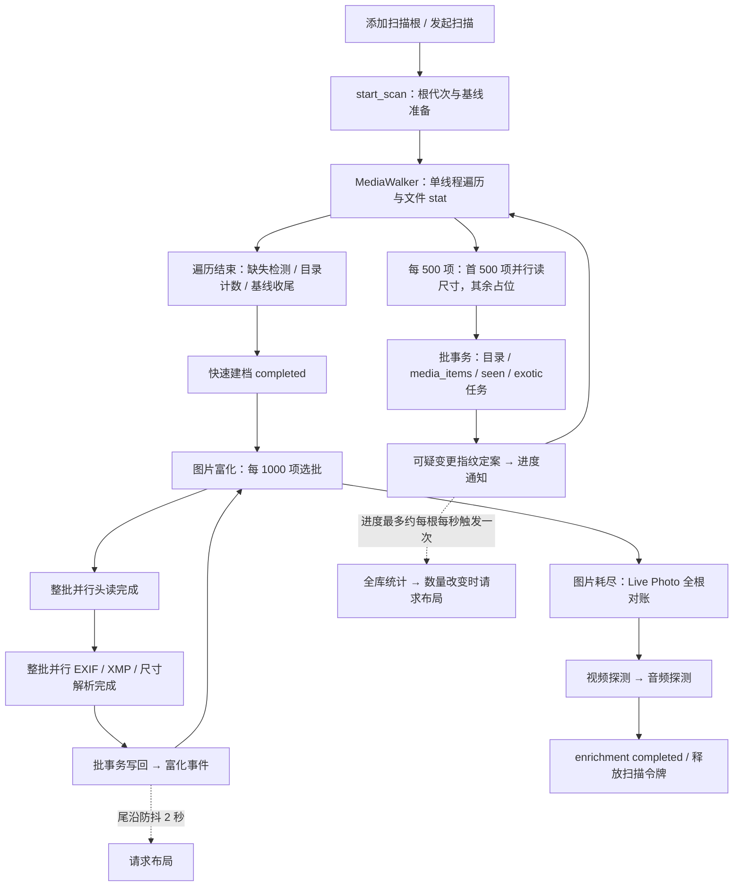

# 文件夹入库—元数据扫描建档流水线性能调查

> 施工前快照（2026-09-12）：目录收尾事务、图片批内头读/解析形态及前端刷新策略已有后续施工。当前实现与验证边界见[实施报告](2026-09-12-入库元数据流水线性能优化实施与验证.md)，下文保留调查时证据。

本报告依据 2026-09-12 工作区业务代码（HEAD `33f54140`）。调查范围为添加文件夹、快速建档、图片/音视频元数据富化及其直接触发的数据库和画廊工作。未改业务代码、未扫描或写入用户真实媒体库。代码中的固定预算与调度关系是已核验事实；热点的耗时占比和优化收益仍需真实库测量。

## 1. 结论

主要问题不是缺少线程，而是各阶段按大批次等待完成、部分工作随全库或全根规模重复执行。首次导入重点查遍历与富化的批次屏障；已有大库继续导入重点查全库统计和布局取数；多目录或 quick 重扫重点查 seen 回填、收尾计数和 Live Photo 对账；批量修改时间后的重扫还可能触发串行文件指纹读取。

已经落地的头缓冲复用、单次文件 stat、SQL 语句缓存、keyset/队列表分页和 seen 流式写入应保留。不能直接沿用 8 月报告中的旧缺陷清单，也不能把提高并发数作为统一解法。

## 2. 当前调用链

- `src-tauri/src/ipc/scan_commands.rs:696-718,751-776`：先等待快速扫描结束，再启动后台富化；同根各阶段不重叠。
- `src-tauri/src/scanner/fast_scan.rs:54,815-874`：500 项分批，文件遍历、eager 尺寸、写库顺序执行；内部尺寸计算使用 rayon，不能称整个流程只有一个工作线程。
- `src-tauri/src/scanner/enricher.rs:117,619-818,852-903`：图片批量 1000，头读、解析、写回逐阶段完成；所有图片之后才配对 Live Photo、探测视频及音频。
- 文档深层解析、缩略图、exotic worker 派生属于后续或旁路任务；扫描令牌释放不等于这些任务全部结束。派生和 AI 已对扫描让步（`state.rs:1052-1081`、`derive/pipeline.rs:434`），不能泛称 AI 与扫描持续抢占。

## 3. 瓶颈与优化次序

### F-001：批次屏障与混合媒体等待

**代码事实**：快速扫描直到本批写库和可疑变更定案完成，才继续读取下一批目录项。图片富化则先收齐 1000 项头读结果，再解析整批、写整批；没有下一批头读与当前批解析/提交的重叠。某个慢文件能推迟本批全部结果发布，图片大库也会延后视频/音频元数据的首个结果。

**适用场景**：冷缓存、慢盘、网络挂载目录，以及包含异常文件的混合媒体库。瓶颈比例受存储和格式分布影响；同一机械盘同时遍历与读取可能反而增加寻道。

**建议**：先测各阶段等待与服务时间；若确认明显空转，采用小容量有界流水线或双缓冲，使下一批头读与本批解析/写回重叠。保留单写者、generation/source revision 校验、取消与 seen 完整性语义。再评估图片/视频/音频公平调度，不能破坏 Live Photo 配对依赖。不要先全局加线程或一次性并行所有媒体阶段。

证据：`fast_scan.rs:820-874,979-1020`；`enricher.rs:619-754,852-903`。

### F-002：大批头缓冲、保留句柄及慢格式尾延迟

**代码事实**：头读池为 `clamp(逻辑核数×2,4,32)`，解析池约为逻辑核数减一；这限制活跃工作线程，不等于最多只开 32 个文件。每批 `HeaderRead` 保留文件句柄和字节，全部解析结束才在写事务前释放。

1000 个足够大的 JPEG 仅头字节约 **125 MiB**，TIFF/HEIC 类约 **250 MiB**，普通 64 KiB 档约 **62.5 MiB**；均不含对象、解析分配和 DB 缓存。成功头读可保留约 1000 个句柄。这是按代码上限计算的单批预算，不是实测 RSS；多根同时富化会叠加。

**建议**：将批次条数、在途字节和句柄数分别计量，再决定是否降低在途批量或逐块移交解析。头读已复用文件大小及文件句柄，常见 EXIF/XMP/尺寸不应重新拆成多个独立 open。完整文件回退也不代表每次一定顺序读完整个文件，要区分 seek 探测与实际读取量。

**特殊格式边界**：TIFF 尺寸探测的“5 秒超时”只限制调用方等待：`run_with_timeout` 新建 detached 线程，超时不会中止内部解析。多个异常文件可累积未退出线程，5 秒也不覆盖前置文件头读取和 EXIF 解析。因此不能宣称单文件最多处理 5 秒。应统计 TIFF 超时次数与残留工作，再考虑有界、可回收的 worker 隔离。

截断 EXIF 判断中，JPEG 可在 SOS/EOI 证明没有后续 EXIF；PNG/WebP 可以读 chunk 头并 seek 跳过 payload，但仍在“解析段”执行文件 I/O。TIFF/HEIC/AVIF 在头部不足时保留文件回退。此处的解析池不是纯 CPU 工作，缩短批次或跨批预读的收益需要包含这部分读取成本。

证据：`enricher.rs:202-220,619-754`；`metadata.rs:15-38,94-116,186-219,398-427,485-592`。

### F-003：扫描期全库统计与布局取数放大

**代码事实**：`scanStore` 在扫描进度回调中，每个运行根最多约每秒调用一次 `loadStats()`。`get_app_stats` 对 `media_items` 做一次全表 FILTER 聚合（八个指标合在一条查询中，不是八次扫表）。只有统计的总数量变化才通过 watcher 请求布局；隐藏页面有延后重算保护。

扫描提交和富化写回都会推进 `data_version`，版本变化使旧布局 items 缓存不再命中。当前视图为全库时，刷新可能重新取全库几何并排版；局部视图应按实际匹配集合计量。`mediaStore.ts:196-200` 已将计算中请求合并为最新一份待执行参数，常态不会无限堆积布局请求；问题是可能持续忙于重算，以及没有同等合并保护的统计取数。不能断言所有布局调用都未命中缓存。

富化事件是 `clearTimeout + setTimeout(2000)` 的**尾沿防抖**。连续间隔小于 2 秒的事件会一直推迟这一条重排路径，不能称为“每两秒持续刷新”。同一根快扫和富化是先后阶段，也不能机械相加为两条同时发生的频率。

**适用场景**：已有数十万项时追加导入、画廊保持打开、多根同时扫描。是否出现背靠背重算，需要实际记录调用次数、缓存命中和服务时间；旧注释中的耗时不是本轮测量。

**建议**：统计请求全局合并在途、扫描期间降低完整统计频率并在结束时核对；布局采用有最大等待时间的合并节奏，区分进度展示与数据失效。若局部更新证据充分，再做几何增量处理。

证据：`src/stores/scanStore.ts:389-413`；`src/stores/mediaStore.ts:456-458`；`src-tauri/src/db/queries/media.rs:689-731`；`src/composables/useGalleryTauriSync.ts:48-76`；`src/composables/useJustifiedLayout.ts:193-200`；`src-tauri/src/ipc/layout_commands.rs:353,419-469`。

### F-004：目录收尾提交碎片与全根 Live Photo 对账

**代码事实**：`finalize_scan_root` 在同一个写锁范围内循环更新各目录 `media_count`，外面没有批事务，每条裸 UPDATE 自行提交。每 500 项主批事务结束后，还会额外更新一次根进度状态。前者随目录数增长，后者随批次数增长；不是整个建档过程逐媒体 autocommit，主体已经批事务化。

图片段之后，`pair_live_photos` 每次收集该根全部 JPEG/HEIC/MOV/MP4 等候选、现有关联，并在事务和 writer 锁内完成分组对账。即使此次没有新图片元数据，仍进入配对阶段。成本随候选数和关联数增长，不只是本轮变化量；静态代码不能证明这一定是最大耗时段。

**建议**：目录计数先合并为短事务，这是范围较小的确定性优化；保持 dirty 基线在全部成功后才清除。Live Photo 按受影响目录处理有潜在价值，但需同时覆盖旧目录、移动跨根和解除配对，不能只处理当前新增文件。

证据：`fast_scan.rs:380-414,1050-1061,1086-1099`；`db/queries/scan/directories.rs:465-471`；`enricher.rs:852-861`；`live_photo.rs:55-113`。

### F-005：quick 与可疑变更仍有线性工作

**代码事实**：quick 在 walker 逐媒体 stat 前剪枝，但仍需要按目录判定、查询该目录存量媒体 ID，并逐项回填 TEMP seen。它减少文件 I/O，不等于复杂度只与变化文件数相关；无变化 quick 也可能产生与存量媒体数成正比的 DB 工作。

前端自动模式的 `fullScanCompleted` 是会话内 Set，重启后首次自动模式会传 `quick=false`；显式快速扫描可以传 `quick=true`，复用数据库持久目录基线。后端还有持久 `scan.baseline_incomplete.<root>` 标记，上一轮未完整收尾才强制降级。故“重启后必定全量”只适用于自动模式这一条件，不能描述所有入口。

对可疑变更，快速扫描会在批事务外逐项计算内容指纹，再短写定案。触发条件为：已有同目录同名项、mtime（含纳秒）改变且 size 相同。≤64 MiB 走全文 SHA-256，更大文件读头/中/尾各 256 KiB；批量 touch 或同大小文件修改可能把扫描转为大量数据读取。首次新增、mtime/size 均不变的完整重扫、size 已改变的分支均不走这条哈希路径（`db/queries/scan/media_upsert.rs:264-342`）。

**建议**：先统计 quick 剪枝数、回填 seen 行数和 suspect 比例。seen 若成为热点可评估集合式写入，保持根与 generation 隔离及缺失检测语义；指纹任务可评估小并发并批量定案，但不能取消内容确认来换取速度。自动 quick 策略应复用持久完整基线，而不是简单持久化一个未经验证的前端布尔值。

证据：`fast_scan.rs:265-338,622-659,736,979-1000`；`utils/hash.rs:156-197`；`src/stores/scanStore.ts:265,363,422`；`src/components/sidebar/sections/ManagementSection.vue:204`。

## 4. 已有优化与非结论

- 流式 walker 每批 500，避免先收集所有媒体再处理；文件级 `symlink_metadata` 已单次取数。不过目录缓存、seen TEMP 表及 Live Photo 候选仍随规模增长，不能称全流程内存 O(1)。
- 默认图片排序已有 keyset 与索引；不能 keyset 的视图排序已有带代次的 TEMP 队列。不再把每批重复 ORDER BY 的历史 O(N²/批量) 缺陷当作当前常态。
- 热 upsert 已 `prepare_cached`，目录唯一索引覆盖已有访问前缀，旧冗余目录索引已删除。
- SQLite 已 WAL、NORMAL、busy_timeout 和专用写连接；单写锁本身是架构约束。应该测锁等待和持有时间，而非直接改多写者。
- 头缓冲、EXIF/XMP 共读、已知文件大小复用、格式级无 EXIF 判断、写回前关闭头读句柄已经存在。
- 本报告不宣称某项可提速若干倍，也不以简化 SQLite 或功能单测代替真实媒体库性能基准。

## 5. 测量与验收方案

已有 `scan_commands.rs:623-627,839-858` 完整流水线 span 和 `fast_scan_ms/enrichment_ms/orchestration_ms/total_ms`；`enricher.rs:477-499,906-917` 还有 EXIF 路径计数和池规模。缺口在以下分段：

| 测量项 | 目的 |
|---|---|
| 遍历/单文件 stat、eager 头读、suspect hash | 区分目录延迟与真正的数据读取 |
| 选批、header、parse、提交每批 P50/P95/最大值 | 确认阶段空转、批内慢项与发布延迟 |
| writer 锁等待/持有、目录收尾、Live Photo | 决定先减 SQL 还是先缩锁范围 |
| 格式、回退原因、实际 read 字节与 open/seek 次数 | 不把逻辑文件大小当物理 I/O 吞吐 |
| GET_STATS / compute_layout 次数、耗时、缓存命中 | 量化界面引起的附加工作 |
| 首批可见、快扫完成、元数据完成、各类型首个完成 | 同时衡量用户等待与总吞吐 |
| 峰值 RSS、保留句柄、多根池数量 | 校验并发改动没有转成资源膨胀 |

验证矩阵：首次入库、无变化 quick、无变化完整扫、约 1% 变化、批量 touch、异常媒体；普通 JPEG、无 EXIF PNG/WebP、TIFF/HEIC、混合音视频；单大目录与多小目录；单根与多根；画廊开启与关闭。先在隔离库做暖缓存对照，再控制冷缓存条件；相同语料和 build 重复至少三轮，记录操作系统/存储/逻辑核数/格式分布。

正确性底线：最终条目及元数据一致，异常文件有终态，取消/重启不污染新 generation，缺失检测不误标，Live Photo 移动/解绑不回退。性能方案先用分段时间说明收益来源，再比较总耗时和首批可见时间。

`scripts/acceptance/isolated-app-smoke.mjs:1530-1558` 的既有 full-scan 检查等待快速建档 Channel completed、核对条目数和 elapsedMs；这不能单独证明全部元数据富化已完成，也不是大库性能结果。

## 6. 本轮验证

已由三路子代理调查、主会话交叉核验关键控制流及数据访问；未修改业务代码。审查期间 HEAD 变为 `8cba3d97`，与起始基线相比相关扫描/DB/前端被审代码无差异。

隔离 SQLite 探针采用仓内 schema DDL 与产品 SQL、合成 JPEG 行、暖缓存、WAL/NORMAL、单进程 Python 驱动。每项重复三轮取中位数；目录对照交替顺序，且两组每轮均写入不同值，避免第二组同值更新的偏差。

| 实验 | 规模 | 三轮中位数 | 能支持的结论 |
|---|---|---|---|
| 全库统计 | 5000 / 200000 行 | 0.9 / 34.7 ms | 该访问计划为 `SCAN media_items`，随库量增加 |
| Live Photo 候选读取 | 200000 行 | 255.8 ms | 该简模计划含临时排序；仅候选读出，未覆盖关系对账与写回 |
| seen TEMP 逐行写入 | 200000 行，500项提交 | 165.6 ms | 逐行操作有线性成本；不能据此定为主要瓶颈，quick逐目录回填也非同一事务分组 |
| 目录计数，逐条提交 | 2000 目录 | 19.2 ms | 此简模中提交碎片有可见成本 |
| 目录计数，单事务 | 2000 目录 | 2.2 ms | 局部约8.7倍差异，仅省约17ms，不能当整库提速倍数 |

探针还确认存在性查询使用 `(directory_id,file_name)` 唯一索引。局限：外键在探针中关闭，V19 依赖应用标量函数的树键回填跳过；不含 Rust、真实文件 I/O、界面及多根竞争。查询扫描计划和相对成本可作方向证据，绝对时间不能外推到产品。工作区复现实验留在 `.research-tmp/scan-perf/probe.py`，原始结果为同目录 `result.txt`（临时实验文件未纳入业务代码）。

本轮未跑真实媒体库导入、未全量编译，也未把功能验收历史结果作为性能结论。业务瓶颈排序仍应由第5节分段测量确认。
