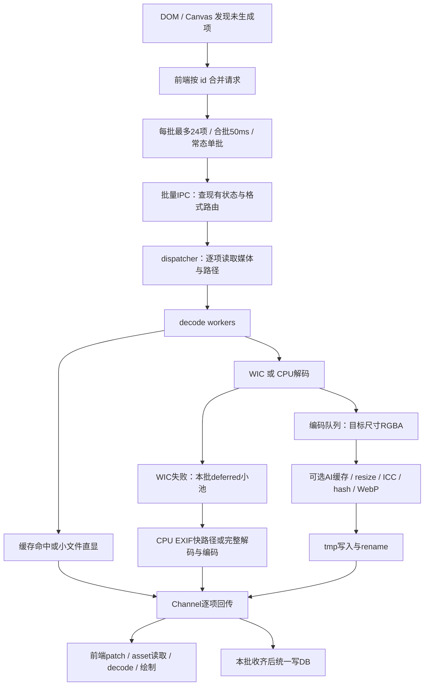

# 缩略图生成流水线性能调查

> 调查日期：2026-09-12。基于本地当前源码；主会话核查时 HEAD 为 `8cba3d97`。本次为代码调查，未测当前设备的生成吞吐、阶段耗时占比或峰值内存，未修改业务代码，未触发真实图库重生成。下文性能优先级是根据工作量与依赖关系给出的验证顺序。

## 1. 结论

当前最值得优先验证的是：**未生成首屏的批间队头阻塞、短批反复建线程、大图 CPU 完整解码、全量任务的回退阶段屏障，以及像素队列的内存反压**。不能据现有日志将其中一项宣布为当前机器的最大耗时来源。

| 用户场景 | 优先调查的限制 | 证据强度 |
|---|---|---|
| 未生成区域首览 | 24 项批串行 + 每批 50ms 合批；慢项阻塞后续批 | 控制流与队列测试确认，实际 ms 待测 |
| 普通小图密集生成 | 每批建立约 2.5×budget worker；逐项两次查库 | 源码确认固定工作量，成本占比待测 |
| 高像素图片，CPU 策略或回退 | 完整解码后才缩小；直显小文件也可能全解码做 hash | 调用顺序确认，格式/像素决定实际成本 |
| 全库且 WIC 失败项较多 | 回退任务全部等主阶段排空才开始处理 | 阶段屏障确认，失败占比待测 |
| 全库、编码/磁盘比解码慢 | 编码队列容许积压 1024 个像素缓冲 | 容量确认，内存量为推算 |
| 全库生成同时浏览 | 缺少跨入口共享预算与生成在途去重 | 后端控制流确认，重复率待测 |

## 2. 生成路径

全量/增量生成由 `thumbnail_full_gen.rs:150` 进入，复用解码编码函数但拥有自己的池：主阶段完成结果每 50 条落库，100ms 节流进度；失败回退项先存 Vec，主结果通道排空后再用局部 Rayon 池处理。它与视口路径的即时 deferred 消化并不相同。

视频/音频/文档封面属于 `derive/`，冷门格式经 exotic 路由让给独立 worker；不能把全部格式的等待都归给普通图片线程池。当前有效生成档位为 `[64,128,256,512,1024]`，一项一次生成选中的档位；已有多档由 serve 选文件，不会仅因存在多个档位就反复解码。

## 3. 瓶颈与场景

### P1：首屏批间串行，让最慢一张拖住后续整批

`src/composables/useRequestQueue.ts:100` 取最多 24 项，`:162` 只在 pending 全部清零时释放本批；invoke 结束和停滞看门狗也可释放。`:185` 的 isFlushing 禁止下一批常态并发，`:188` 给下一批再次设置 50ms 定时器。每条结果会立即回流，所以**本批快图不用等慢图显示，但后续批不能开始**。

例如首屏有 240 张未生成图片，会经过 10 个批次及其合批等待；第 1 批中一张慢图延迟第 2–10 批开始。30s 无进展看门狗是恢复手段，不是正常调度预算。

建议先消除持续有积压时重复的 50ms 空档，再评估有限在途任务窗口。不要直接无限并发：下面的后端预算问题应先解决或同步验证。验证包括混合快慢样本的首张/P95、后台实际在途数及 CPU 峰值。

### P1：每批重新建立多组线程，预算并非整条流水线总上限

`thumbnail_commands.rs:416,460,531,570` 每次非空生成批创建 dispatcher、budget 个 decode、budget 个 encode、max(1,budget/2) 个 deferred worker。`thumbnail/qos.rs:12` 的 budget 为逻辑核减 2 或 4，最低 1。

16 逻辑核时 budget=12：**每批 30 个阶段 worker，另有 dispatcher 与 blocking 调用线程**。这不等于 30 个线程一直同时忙，但 24 张短批也支付建线程成本；池内 WIC factory 又按项创建（`wic_engine.rs:41`）。QoS 注释称三池约等于逻辑核数，与当前池数相加不符。

普通前端队列常态只运行一批，不能把快速滚动直接描述为无限批重叠。真正需要验证的是全量+视口同时运行、看门狗释放但旧后端仍运行后重试等情况：后端两个入口各自建池，未共用按生成项去重与 CPU 总预算。源快照条件写能防陈旧结果污染，不能防已经重复消耗的解码与写盘。

建议让现有阶段复用长寿命 worker 并共用总预算，按媒体身份/源版本合并在途任务；随后再调整前端窗口。WIC factory 的 worker 内复用作为小图子实验，不先假定 COM 初始化是主瓶颈。

### P1：CPU 路径先全解码，小文件直显也有隐藏解码

`engine/image_rs.rs:45–79` 先解出完整 DynamicImage，再按长边 resize。适用条件是 CPU 路径且 EXIF 快路径未成功；默认 WIC 路径不可直接套此内存结论。

24MP 图片若以 RGB8/RGBA8 表示，仅像素工作集约 72/96MB（十进制，量级推算，非当前峰值），还未计旋转、缩放及多个 worker 的并行缓冲。当前 image Limits 是单次分配保护，不是全流程共享内存预算。

另外 `generator.rs:285–291` 对 ≤500KB 的直显图用 `engine.decode(abs_path, None)` 生成 ThumbHash；压缩字节小不意味着像素少。这个分支没有产生缩略图文件，仍可能付完整解码和 hash 前缩放成本，且前端之后会再解原图显示。

建议先按像素、格式和策略测 decode/resize；高像素 JPEG 优先评估解码器降采样或合格内嵌图，保留方向、ICC 与分配限制。直显 hash 改为有限目标尺寸能减少后续缓冲，但仅传 ResizeHint 尚不能消除 image-rs 内部完整解码。

### P1（条件性）：全库回退有阶段屏障

`thumbnail_full_gen.rs:491` 将回退项压入 deferred_items，`:547` 才启动 Phase 2，前提是主 result_rx 已经结束。回退项在主阶段不能产出结果，形成 `主阶段墙钟 + CPU回退墙钟`，其间无法重叠。

视口路径已经用独立小池即时处理回退，可作为统一行为的参照。建议在共享资源预算内及时消费回退项；是否加速取决于主阶段 CPU 饱和程度和 WIC 失败占比，不能预报固定倍数。

### P1（全库内存）：1024 个槽按条数限流，而非按像素字节

`thumbnail_commands.rs:404–409` 与 `thumbnail_full_gen.rs:283–284` 的队列容量固定 1024。**只有 encode 队列携带 DecodedImage 像素；decode 队列是媒体记录和路径，不能把像素内存乘两份。**

4:3、512 档时每项 `512×384×4 = 786432` 字节，encode 队列满载约 **768MiB**；1024 档同假设约 **3GiB**。这是容量允许的缓冲量，不是实测 RSS；还没算活跃解码器与后处理拷贝。普通 24 项前端批无法独自填满 1024 槽；风险主要在全量任务或大批调用，AI 宽幅缓存还可能增大解码目标。

建议先用较小的按 worker 数配置队列做 A/B，并采样队列字节和 RSS；极端尺寸差异明显时再用字节预算。队列扩大只能延后反压，不能提高慢编码/慢盘的服务能力。

### P2：串行查库、后处理拷贝和同步写盘

- dispatcher 每项 `get_media_item + get_item_path_info`（`thumbnail_commands.rs:427–430`，全量 `thumbnail_full_gen.rs:321–323`），是在批量缓存查询后又做的两次单行查询。可用一轮批量关联查询返回生成所需记录与路径，优先在小图高吞吐场景测收益。
- `generator.rs:518` 为 hash 克隆小图，`:556` 尺寸已满足时仍复制 pixels，`thumbhash.rs:29` 又构造自有缓冲。其成本随像素变化，不能称为与档位无关。常态 encode resize 分支已短路，**不能说每张都两次 resize**。
- 后处理包含 WebP、可选 AI 缓存及同步 `write + rename`（`generator.rs:66–82,493–530`）。编码线程被写盘阻塞会向上游反压；先分开计时再决定是否拆写入阶段。q100 是无损，不能与 q80 混成同一组。原子写契约必须保留。
- 视口 Channel 逐条送出后，`:624` 才统一 flush DB，因而存在“前端已收到而 DB 尚未更新”的窗口。普通批最多 24 项，本身规模很小；改成“50 条批写”不能解决这一窗口，不作为独立高优先吞吐优化。

### 低优先或需特定证据的项

- 生命周期锁覆盖 decode/encode 闭包，但它是共享读锁，worker 之间不因此串行。应测清缓存/切库等写者等待，而不是仅凭逐项取锁将其列为主瓶颈。
- 404 懒自愈 `thumbnail_commands.rs:754–759` 每项使布局/项目缓存失效并发事件；批量丢缓存时可能反复做共享失效工作。适合按结果合并，但不是健康冷生成的必经瓶颈。
- status=2 在批量 IPC 被直接回送。它是失败恢复策略问题，不能把永久占位等同于生成慢。
- 缓存治理四目录全量遍历是周期性 I/O 干扰源，不应把它当每张生成的固定费用。

## 4. 已核实的配置和测量边界

当前默认配置来自 `src-tauri/src/config/schema.rs:468`：目标长边 512、strategy=gpu、gpu_engine=wic、WebP q80、直显阈值 200KB、AI 高清缓存关闭。实际用户配置可能覆盖默认值。

- `generator.rs:260` 的真实判据是文件大小 **≤阈值** 时直显；schema 对 thumb_skip_max_kb 的说明写成“超过”，与实现相反。分析按代码判据，不按设置文案。
- `engine/gpu/wic_engine.rs:39` 使用 WIC COM factory、scaler、converter。当前普通图片路径未接入 CUDA/NPP 解码，不能用“GPU 占用低”证明调度失败。
- `engine/image_rs.rs:45` 完整解出 DynamicImage，随后 `:64` 按 ResizeHint 缩小；传入 hint 不代表解码器内部已降采样。CPU 路径大图成本明确存在。
- WIC 则在 `wic_engine.rs:109` 建 scaler，`:142` 按目标尺寸分配输出缓冲。不能从这段调用顺序推断 codec 内部一定分配整图；9/6 旧报告对此的表述过强。
- `generator.rs:491` 开始的 ENCODE_OK 计时包含可选 AI 缓存、resize、ICC 转换、ThumbHash、编码、目录检查、写临时文件和 rename；它是后处理阶段总耗时。
- 批量 IPC 有总 span（`thumbnail_commands.rs:146`）；全量有整轮计时（`thumbnail_full_gen.rs:248,648`）。现有代码不足以将排队、解码、纯编码、写盘和 DB 等待分开排序。
- `src-tauri/benches/logging.rs:134` 使用同一张 256×256 PNG、CPU、30 次串行调用，意图测日志成本；无法代替真实多 worker 混合图库生成基准。
- `scripts/bench/canvas-realapp-bench.mjs:19` 的 cold 指已生成缩略图的 LRU 冷加载；不能用于回答未生成图库的首屏等待。
- [7 月 A/B 记录](../designs/2026-07-10-缩略图流水线深审与优化.md) 的 7.3s vs 16–20s 仅作为历史选型证据。本轮未复现，不能外推当前吞吐或修改收益。

## 5. 最小测量方案

使用隔离数据库与缓存、固定文件清单，避免扫描/AI 等并发任务混入基线。先记录机器逻辑核、前后台状态、构建 profile/features、策略/尺寸/质量、格式和像素分布。发布优化构建用于吞吐结论。

| 场景 | 主要回答的问题 | 核心指标 |
|---|---|---|
| 新库首屏，普通小图 | 合批、队列、线程启动是否主导等待 | 首张/P50/P95 首次可见、队列等待、线程峰值 |
| 12–48MP JPEG/PNG 冷生成 | 解码与缩放成本、WIC/CPU 差异 | 解码 ms、resize ms、张/秒、峰值 RSS |
| 全库批量，含 WIC 不支持/失败样本 | CPU 回退长尾及阶段重叠 | 回退占比、首个回退完成时间、总墙钟 |
| 全量生成期间滚动未生成区 | 跨入口重复工作与竞争 | 同源实际解码次数、在途数、首屏 P95 |
| 慢盘/外置盘缓存，q80/q100 分组 | 编码和写盘谁形成反压 | encode/write/rename ms、编码队列深度 |
| 视频/RAW/PDF 混合样本 | 独立派生通道拖尾 | 按 kind 的排队/执行/发布耗时、失败率 |

每个场景至少重复 3 轮，分开报告“派生产物冷”和“操作系统文件缓存冷”；清空产物不等于清空 OS 缓存。输入集、设置、窗口前后台状态保持一致。极慢/损坏文件独立分组，避免混合均值掩盖长尾。

按 item_id + source_revision + cache_key + 请求/运行 ID 关联：入队 → 开始解码 → 解码结束 → 后处理 → 编码 → 写盘/rename → DB 提交 → Channel/事件到达 → 首次绘制。同时采样队列深度、活跃 worker、进程 RSS 与重复解码次数。

流水线吞吐由最慢阶段的并行服务能力限制，近似 `min(各阶段 worker 数 / 单项服务时间)`；用户看到图片的时间还包括前后排队。阶段耗时相加适合单项关键路径，不能把并行阶段累计耗时直接相加当整轮墙钟。

## 6. 优化顺序与验证

1. **先有分段基线**：至少首屏与全库各一组，记录默认 WIC 与 CPU 的差异，分开回退/直显/EXIF 命中。
2. **首屏调度批**：持续积压时立即衔接下一批；后端 worker 复用及统一资源预算；在此基础上再比较单批、有限任务窗口。保留逐项回传与迟到结果隔离。
3. **全库调度批**：回退即时消费、缩小像素缓冲队列、批量读取生成记录；比较总吞吐、P95 和 RSS，避免只优化其中一项。
4. **解码批**：若大图 decode/resize 占比领先，再做格式级降采样与 EXIF 快路径设计。不要因 `gpu` 名称直接扩展 GPU 并发。
5. **后处理批**：按纯编码、写盘、hash/拷贝测量决定缓冲复用、WIC factory 复用或 I/O 重叠，保留 ICC、源版本条件写、原子写与取消契约。

本轮验证：子代理运行 `npx vitest run src/composables/useRequestQueue.spec.ts --reporter=basic`，23 项通过（总计319ms），确认批串行/停滞/退避等现有语义；主会话亲核关键控制流、通道 payload 和像素内存算式。未运行真实生成基准，未改变并发参数，未编译 Rust。收益数值留待上述隔离测量。

文档检查 `npx --yes --package worklog-kit@0.1.0-alpha.4 worklog-kit check`：补齐本次 closeout 稳定 id 后，本次新增报告/工作记忆无报错；全仓检查仍 exit 1，剩余26处均在其它存量文档，未在本轮修改。

审查中排除了几个容易误导优化的推断：WIC 必定分配整图、普通滚动无限创建重叠批、两条队列都存像素、CPU EXIF 总被尝试两遍、每张总有两次 resize。后续实现应以本报告限定后的结论为准。
